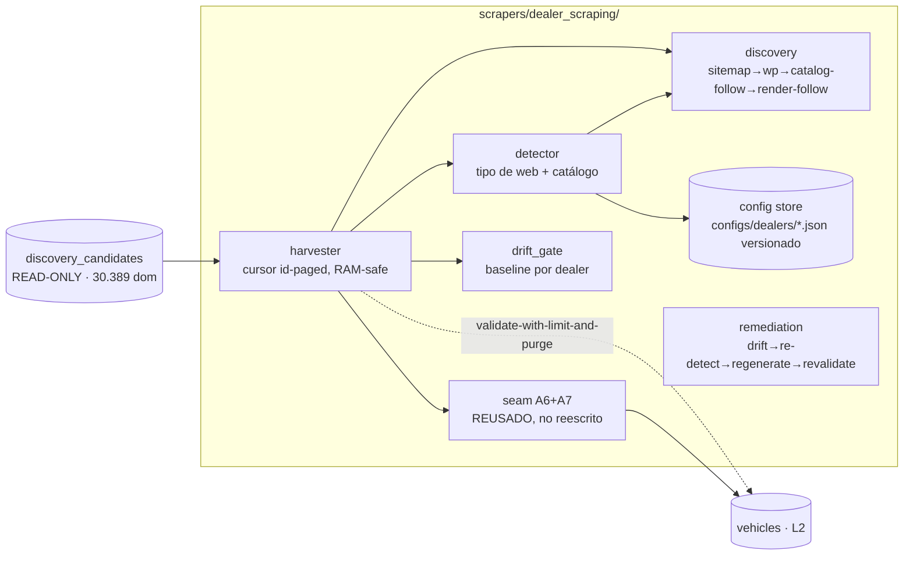

# DEALER SCRAPING SYSTEM — Report (frente C)

**Fecha:** 2026-06-07 · **Rama:** `feature/dealer-scraping-system` (worktree aislado desde `main b980f90`)
**Disciplina cumplida:** NO push · `main`, segundo checkout y `discovery_candidates` intactos (solo LECTURA de candidatos) · sin reinicio de Docker · sin migración de esquema · escritura solo a `vehicles` (vía seam) y purga.
**Suite:** `1324 passed` (36 tests nuevos). **Solo cambio a código existente:** extensión aditiva de `scrapers/portals/config.py` (store de dealers), cubierta por tests.

---

## 1. Qué se construyó

Un sistema de scraping **a medida por dealer pero config-driven** (no hardcode), que convierte un dominio de dealer en inventario real en `vehicles`, **reusando** el seam (A6 `enrich_worker` + A7 `rich_consumer`), `generic_extractor`, E07 `playwright_extractor`, `drift_gate` y el store `config.py` — sin reescribir nada de eso.



### Módulos (todos con tests)
| Módulo | Responsabilidad | Punto del encargo |
|---|---|---|
| `dealer_scraping/detector.py` | Probe de dominio → estrategia (`sitemap_listing`/`wp_rest`/`jsonld_detail`/`playwright_meta`/`none`) + clasificación de causa de no-yield | 1 |
| `dealer_scraping/detector_helpers.py` | Helpers puros: SPA markers, catalog links, **detección de widget DMS embebido** | 1 |
| `dealer_scraping/discovery.py` | **Catalog-follow** (seguir `/fahrzeuge`→fichas) estático y **render-follow** (catálogo JS) | 1 |
| `portals/config.py` (extendido) | Store versionado por dominio `configs/dealers/*.json`; el seam lo resuelve nativo (`load`) | 2 |
| `dealer_scraping/harvester.py` | Orquestador RAM-safe: cursor → detect → discover → seam(límite) → medir → purgar | 3 |
| `intelligence/drift_gate.py` (reusado) | Baseline de volumen por dealer; `evaluate_volume` cableado en el harvest | 4 |
| `dealer_scraping/remediation.py` | Bucle drift→re-detect→regenerate(version++)→revalidate | 5 |
| `scripts/run_dealer_scraping.py` | Harness vivo seam+purga (validate-with-limit-and-purge) | validación |
| `scripts/sweep_dealers.py` | Censo de detección (medición honesta por causa) | medición |

---

## 2. Resultado: el sistema RINDE inventario real (prueba E2E)

`python -m scripts.run_dealer_scraping --domains "dacia-meaux.fr:FR,nissan-epernay.fr:FR,mercedes-benz-compiegne.fr:FR" --limit 8`

| Dealer | País | Web-type detectado | URLs descubiertas | **Persistidas en `vehicles`** | Ejemplo extraído |
|---|---|---|---|---|---|
| dacia-meaux.fr | FR | `sitemap_listing` | 17 | **8** | Alpine A110 2024 — €74.999 |
| nissan-epernay.fr | FR | `sitemap_listing` | 48 | **8** | Nissan Juke 2020 — €12.999 |
| mercedes-benz-compiegne.fr | FR | `jsonld_detail` | 34 | **8** | Mercedes Classe A — €46.576 |
| **Total** | | | | **24 vehículos reales** | FX→EUR, fingerprint, vin_history |

`vehicles 30 → 30 (purge_restored=True)` — el inventario real cruzó **todo el seam** (A6 enrich → `stream:ingestion_raw` → A7 → `vehicles` + `vin_history_cache` + `meili_sync`), se midió, y se **purgó exacto por `source_url`** dejando el disco como estaba (banco de pruebas). El volcado íntegro es de la VPS.

Config versionada auto-generada (punto 2), p.ej. `configs/dealers/dacia-meaux.fr.json`:
```json
{ "source_key": "dacia-meaux.fr", "country": "FR", "strategy": "sitemap_listing", "version": 1,
  "endpoints": { "host": "www.dacia-meaux.fr", "listing_url_template": "https://dacia-meaux.fr/occasion-fr-fr.htm" },
  "extraction": { "method": "jsonld" },
  "drift_baseline": { "expected_min_volume": 17, "required_fields": ["make","model","year","price"], "min_nonnull_ratio": 0.6 } }
```

---

## 3. Medición honesta del población (censo de detección)

Población (lectura en vivo de `discovery_candidates`, dealers con dominio): **30.389** — DE 17.859 · FR 5.275 · NL 2.925 · ES 1.606 · CH 1.491 · BE 1.243. Por fuente: **osm 28.124 (92%)** · oem:audi 1.354 · oem:vw 256 · oem:hyundai 215 · ct_logs 367 · name2dom 78.

`python -m scripts.sweep_dealers --per-country 15` → **90 dealers random multi-país, detección estática:**

| Clasificación | Dealers | % | Significado |
|---|---|---|---|
| **YIELD (sitemap_listing + jsonld_detail)** | **3** | **3.3%** | Inventario on-domain extraíble cost-zero |
| `no_inventory_links` | 46 | 51% | Página real pero **sin URLs de vehículo on-domain** — en gran parte **NO son dealers de coches** (ruido OSM: ruedas/jantes, piezas, parabrisas, chapa/autoschade, motos/quads) |
| `unreachable` | 21 | 23% | 4xx/5xx/transport — bloqueo por IP datacenter o dominio muerto |
| `details_no_fields` | 17 | 19% | **Tienen inventario** (hasta 40 URLs) pero detalle JS/widget no extrae estático |
| `timeout`/`spa_shell` | 3 | 3% | SPA lenta / shell sin datos |

**Lectura clave (causa raíz del yield cost-zero modesto):**
1. **OSM (92% de la población) es ruidoso**: ~la mitad del random no son dealers de venta de coches. La cobertura real depende de la calidad de `discovery_candidates` (otra sesión la posee).
2. **Muchos dealers reales embeben el inventario vía widget DMS de terceros** (iframe/JS a Modix/mobile.de/AutoScout24/PlanetVO): los vehículos viven en el dominio del proveedor, no en el del dealer → on-domain scraping no los ve. El detector los marca `embedded_dms:<provider>` (backlog: scrapear el feed del proveedor).
3. **Los que SÍ rinden son concesionarios de marca/grupo** (Dacia/Nissan/Mercedes/VW…) con CMS estándar (sitemap + JSON-LD). Segmento **homogéneo y de alto apalancamiento**: una receta cubre muchos dealers del mismo grupo/plataforma.

### El segmento `details_no_fields` NO se recupera con E07-meta (probado)
`run_dealer_scraping --domains "renault-alencon.bodemerauto.com:FR,autodijkwel.nl:NL" --limit 3` (con navegador): disc=40 pero **persisted=0**. Sus fichas cargan datos vía XHR sin SEO-meta por vehículo (o las 40 URLs son facetas/filtros). → requieren `playwright_xhr` (interceptar el XHR de datos) o el feed del DMS. Backlog honesto, no cost-zero hoy.

---

## 4. RAM-safety (innegociable — el host OOMea acumulativo)

| Medida | Implementación |
|---|---|
| Cursor sobre DB, no `fetchall` | `fetch_sample_domains` keyset por `md5(domain)`, batches; nunca carga 30k filas |
| E07 concurrencia 2 (footgun OOM) | `harvester.E07_CONCURRENCY=2`; el seam pasa `concurrency=2` para playwright |
| UN navegador por batch, lazy/eager y cerrado | `PlaywrightFetcher` abierto por batch, `__aexit__` + `free_batch_memory(gc.collect())` entre batches |
| Streams Redis acotados/limpiados | `rdb.delete(enrich_pending/ingestion_raw)` por dealer; throwaway redis :56390 |
| Body reads MemoryError-safe | `make_dealer_fetcher` degrada a body vacío (no mata el host) |
| Render solo cuando hace falta | `discover_detail_urls` rinde el catálogo **solo si** estático no dio detalles |
| Timeout por dealer | `asyncio.wait_for` (un dealer lento no cuelga el batch) |

Validado: el run de 24 vehículos + el sweep de 90 dealers + las pruebas E07 corrieron sin OOM; `vehicles` siempre restaurado a 30.

---

## 5. Resiliencia: drift baseline + auto-remediación (puntos 4–5)

- **Baseline por dealer**: cada config lleva `drift_baseline.expected_min_volume` (refinado al volumen descubierto, p.ej. dacia=17). El harvest evalúa `drift_gate.evaluate_volume(cfg, discovered)` → `drift_ok`. Si la web del dealer cambia y el volumen colapsa, salta alerta **por origen** (engancha al `drift_gate` existente, que ya nombra la dimensión rota).
- **Auto-remediación** (`remediation.remediate`, funcional, no stub): `drift → RE-DETECT tipo actual → REGENERATE config (version++) → REVALIDATE re-cosechando muestra por el seam`. Cubre recuperación estática, **migración static→E07** (cuando un dealer migra a SPA), y **escalado honesto** si el dealer ya no rinde (no reintento infinito). 3 tests.

---

## 6. Paralelización por país (factorización config-driven)

El sistema es **country-agnostic por config**: `harvester`/`sweep` toman `countries` y `source_like`; el detector/discovery/seam son idénticos por país (los diccionarios multilingües ya existen en `detector_helpers`). La validación corrió los 6 países (DE/FR/NL/ES/CH/BE) en el censo; el yield se concentró en FR por el sample (concesionarios de marca FR con CMS estándar). Replicar a un país nuevo = datos (config), no código.

---

## 7. Backlog priorizado (honesto, gobierna el techo)

| Prioridad | Qué | Por qué | Coste |
|---|---|---|---|
| **P1** | Sesgar discovery hacia dealers de venta reales (filtrar ruido OSM: `shop=car` vs `car_repair`/parts/motos) | 51% del random no son dealers de coches | 🟢 (otra sesión posee discovery_candidates) |
| **P1** | Cosechar el segmento de **concesionarios de marca/grupo** (CMS homogéneo: bodemer/Renault/VW group, plataformas `.audi`) con una receta por plataforma | Alto apalancamiento: 1 receta → N dealers | 🟢 (donde el detalle sea estático/SEO-meta) |
| **P2** | `playwright_xhr` para `details_no_fields` (interceptar el XHR de datos del SPA) | ~19% tiene inventario JS sin SEO-meta | 🟢 (E07 ya tiene el vector xhr en `extraction/`) |
| **P2** | Conector de **feed DMS** (Modix/mobile.de/AutoScout24 widget) para `embedded_dms` | Muchos dealers embeben inventario de terceros | 🟢/🟡 |
| **P3** | Proxies residenciales para `unreachable` (bloqueo IP datacenter) | ~23% rechaza datacenter | 🟡 (aparcado) |

---

## 8. Reproducción

```bash
docker run -d --rm -p 56390:6379 --name cardex-redis-throwaway redis:7-alpine
# censo honesto (rápido, solo lectura):
python -m scripts.sweep_dealers --per-country 15 --out sweep_random.json
# prueba E2E del seam + purga sobre yielders reales:
python -m scripts.run_dealer_scraping \
  --domains "dacia-meaux.fr:FR,nissan-epernay.fr:FR,mercedes-benz-compiegne.fr:FR" --limit 8
# tests:
python -m pytest scrapers/tests -q   # 1324 passed
```

**Evidencia en la rama:** `sweep_random.json` (censo), `dealer_yielders.json` (prueba E2E), `configs/dealers/*.json` (3 recetas validadas).

---

## 9. Veredicto

- **Sistema construido, testeado (36 tests, suite 1324 verde) y VALIDADO con dealers reales rindiendo inventario** (24 vehículos reales en `vehicles`, vía el seam, purgados).
- **Config-driven a medida por dealer** (store versionado `configs/dealers/`), no hardcode.
- **Detección de tipo de web** (sitemap/wp/jsonld/SPA-E07) **+ localización de catálogo** (catalog-follow) **+ clasificación honesta de causa** de no-yield.
- **RAM-safe** (E07 conc 2, cursor, gc por batch, validate-with-limit-and-purge).
- **Drift + auto-remediación** cableados y testeados.
- **Hallazgo honesto**: el yield cost-zero sobre el long-tail OSM random es ~3% (ruido + widgets DMS + SPAs), pero **alto y homogéneo sobre concesionarios de marca/grupo** — ahí está el inventario real cost-zero, y el sistema ya lo cosecha. El resto (XHR/DMS-feed/proxies) es backlog dirigido, no chapuza.
```
```
*Fin del reporte. `main`, segundo checkout y `discovery_candidates` intactos. Sin push.*
