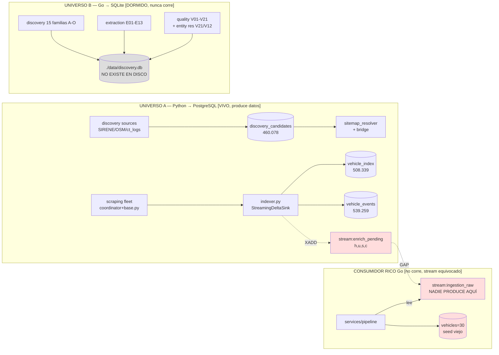
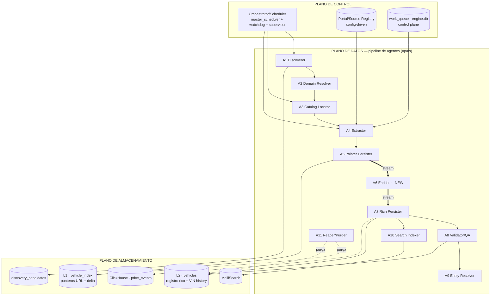
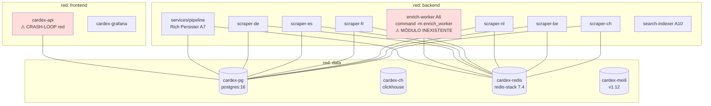
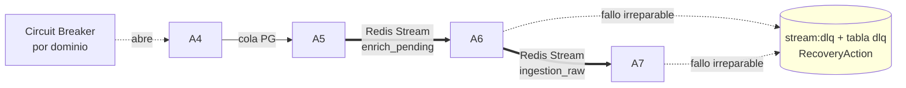
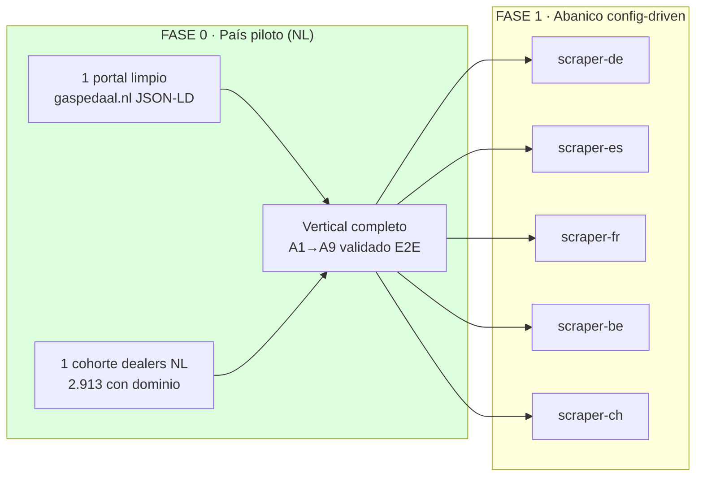
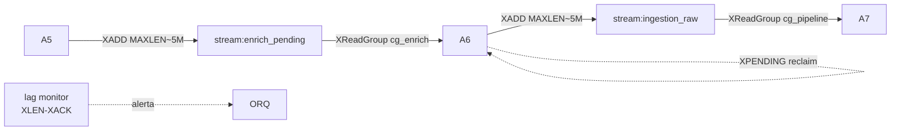
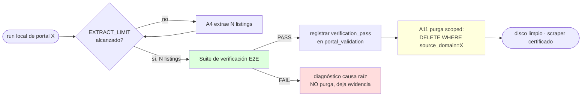
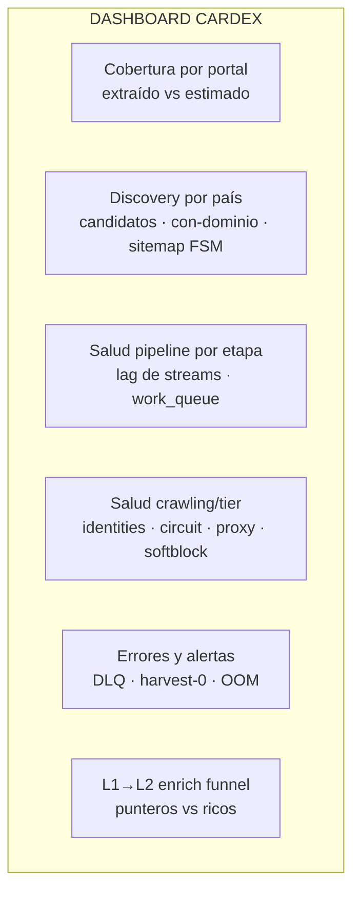
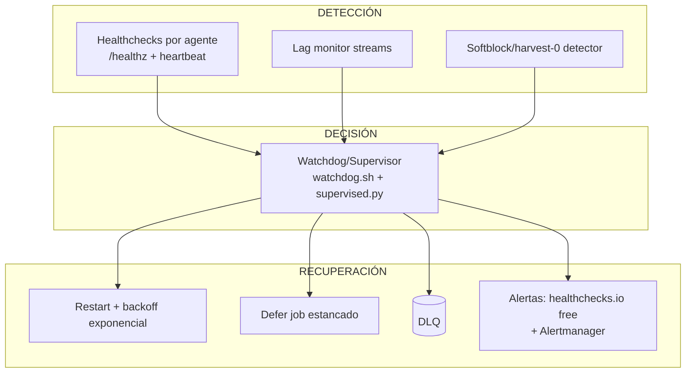
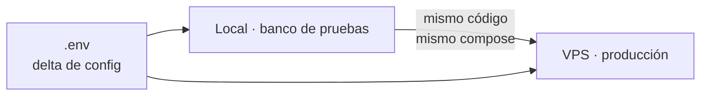

# BLUEPRINT CARDEX — Arquitectura Objetivo y Plan de Construcción

**Versión:** 1.0 · **Fecha:** 2026-06-06 · **Estado:** DISEÑO (untracked, no toca producción)
**Autor:** Arquitecto jefe (sesión de diseño) · **Repo:** `C:\Users\elias\projects\cardex` (`main` @ `6e084a5`)
**Base empírica:** `AUDIT_CARDEX_2026-06-06.md` + `C:\Users\elias\AUDIT_SCRATCH\{portales,discovery,pipeline,engine_git}.md` + lectura directa del código (contratos extraídos verbatim).

---

## 0. Cómo leer este documento

> Este blueprint **NO** reescribe el sistema. Define la **arquitectura objetivo** construyendo
> ENCIMA de lo que ya funciona y reemplazando solo lo podrido/descableado. Cada decisión
> está anclada a un hecho verificado del código (cita `file:line` o tabla del audit). Lo no
> verificado se marca `[ASUMIDO]`. La invención está prohibida (doctrina antialucinación).

**Autoridad de fuentes** (orden de precedencia para ESTE documento):
1. El código observado (`file:line`) y las consultas en vivo a PG/SQLite del audit.
2. `AUDIT_CARDEX_2026-06-06.md` + scratch forense.
3. Este blueprint.
4. `CONTEXT_FOR_AI.md` — **STALE y parcialmente FALSO** (afirma "no PG/Redis/CH"; `docker ps` muestra los 7 contenedores healthy). Corregirlo es una acción P0 (§9). No es fuente de verdad arquitectónica hasta reescribirse.

**Convención de etiquetas:** `[VERIFICADO]` = leído en código/DB · `[ASUMIDO]` = inferencia declarada · `[NUEVO]` = pieza a construir · `[REUSO]` = pieza existente que se recanaliza · `[TIRAR]` = código muerto a borrar.

**Idioma:** prosa en español; identificadores, contratos, código y comentarios en inglés.

---

## 1. DIAGNÓSTICO DE PARTIDA (el "por qué" del diseño)

CARDEX no es un esqueleto para tirar. Es ingeniería real (3.599 LOC de anti-detección cableada, `base.py` con sink streaming, `generic_extractor` completo+testeado, módulos Go que vettean limpio, 1.188 tests verdes) **parada en seco por tres muros**, no por arquitectura podrida:

| Muro | Naturaleza | Evidencia |
|---|---|---|
| **M1 — Techo económico** | Sin proxies (18 identidades, todas `direct`, `proxy_health=0`) los 10 gigantes T2/T3 (mobile.de, AS24×6, leboncoin, coches.net, milanuncios, kleinanzeigen, lacentrale) parkean en `no_identity` por diseño. | `engine.db`; `coordinator.py:407-417 requires_proxy` |
| **M2 — Descableado/orquestación** | Piezas correctas sin tubería entre ellas. El salto "puntero URL → vehículo rico" no ocurre; la cadena de dealers está muerta tras el candidato. | §1.2 abajo |
| **M3 — Bugs concretos** | Falso "done" con harvest-0; `cardex-api` crash-loop por red Docker; `enrich_worker` inexistente; entity resolution a 0. | §9 P0 |

### 1.1 El hallazgo estructural central: DOS universos paralelos + UN seam roto



**El gap triple** [VERIFICADO `pipeline.md §5`]:
- Productor escribe `stream:enrich_pending` con `{h,u,s,c}` (solo punteros URL) — `scrapers/common/indexer.py:163-167`.
- Consumidor rico Go lee `stream:ingestion_raw` con `vehiclePayload` (registro completo) — `services/pipeline/cmd/pipeline/main.go:33`. **Streams distintos; nadie tiende el puente.**
- `docker-compose.yml:793-811` lanza `enrich-worker` con `command:["-m","enrich_worker"]` → **módulo que no existe en el repo.**

Resultado medido: `vehicles=30` (seed), `entities=0`, `entity_matches=0`, `vin_history_cache=0`, dealers crawleados`=0`.

### 1.2 Mapa de estado real por eslabón [VERIFICADO `pipeline.md §6`]

| Eslabón | Código | Cableado | Corre | Datos | Acción del blueprint |
|---|---|---|---|---|---|
| Discovery candidatos (Python→PG) | ✅ | ✅ | ✅ | 460K | **REUSO** (romper sesgo 84% FR, §P1) |
| Domain resolution (name→domain/ddg) | ✅ | parcial | apenas | 78 | **RECABLEAR** (orquestar, §P2) |
| Catalog locator (sitemap_resolver) | ✅ | ✅ | ✅* | sitemap_status all `pending` | **REUSO** (*scheduler no vivo en host) |
| Extracción URL (fleet+base.py) | ✅ | ✅ | ✅ | vehicle_index 508K | **REUSO** (motor de oro) |
| Pointer persist (indexer) | ✅ | ✅ | ✅ | 508K + delta | **REUSO** |
| **Enrich bridge (URL→rico)** | ❌ | ❌ | ❌ | — | **[NUEVO] enrich_worker (§P0-3)** |
| Rich persist (vehicles) | ✅ | roto | ❌ | 30 | **RECABLEAR** (alinear stream, §P0-3) |
| Dealer rich (generic_extractor) | ✅ | ❌ | ❌ | dealer_inv=0 | **RECABLEAR** (§P2) |
| Entity resolution (V21/V12) | ✅ | ❌(SQLite≠PG) | ❌ | 0 | **PORTAR a PG (§P0-4)** |
| Quality gates (V01-V21 / quality.py) | ✅ | parcial | ❌ | — | **RECABLEAR** |
| Search bridge (Meili) | ✅ | workaround | parcial | — | **REUSO** (meili_bridge salta pipeline rico) |
| API (cardex-api) | ✅ | ✅ | **crash-loop** | — | **REDESPLEGAR (§P0-2)** |

**Conclusión de diseño:** el trabajo no es construir un sistema, es **terminar de cablear uno que ya existe** y **consolidar los dos universos en uno**. El blueprint adopta el spine **Python→PG** como backbone productivo, formaliza cada pieza como microagente con contrato explícito, tiende el puente roto, y porta la inteligencia Go (entity res, quality) al store real (PG). **No se inventa una tercera arquitectura** (el audit lo advierte: §7 "dos pipelines, dos discovery — unificar, no añadir").

---

## 2. PRINCIPIOS RECTORES (innegociables)

1. **Construir encima, no reescribir.** Toda pieza `[VERIFICADO]` real se reutiliza. Solo se borra código muerto probado (§Anexo B) y se reemplaza lo descableado.
2. **Un seam, un contrato.** Cada frontera entre microagentes tiene un contrato de datos versionado (schema + cola + idempotencia). Cambiar un campo = migración declarada (cierra TECH-005).
3. **Idempotencia en todos lados.** `url_hash` PK (`ON CONFLICT DO NOTHING`), `fingerprint_sha256` (RedisBloom + `ON CONFLICT`), claims `FOR UPDATE SKIP LOCKED`. Reprocesar nunca corrompe.
4. **Aislamiento de fallos.** La caída de un agente no tumba la cadena: colas desacoplan productor/consumidor; DLQ absorbe lo irreparable; circuit breaker por dominio.
5. **Primero clavar UNO, luego abanicar a SEIS.** El patrón vertical completo se valida end-to-end en un país piloto antes de replicarse. Replicación = config, no copy-paste.
6. **Disco local = banco de pruebas, no almacén.** Validar-con-límite-y-purgar (§7). El volcado íntegro es exclusivo de la VPS.
7. **Stealth temporal, reversible a 100% legal.** Anti-detección permitido ahora; objetivo declarado: acuerdos/APIs oficiales. Nada delictivo. robots.txt respetado en estrategias HTML-crawl.
8. **Presupuesto cero hoy.** Todo lo de pago (proxies, registros, API keys) se aparca en backlog gobernado (§9 P3). El diseño no depende de ello para los tiers T0/T1.
9. **MVCC-safe (ADR-0006).** Solo `INSERT` nuevo + `DELETE` stale. Prohibido `UPDATE` de filas no mutadas (genera dead tuples). `STATUS.md:43`.
10. **JA3 coherente.** Mismo fingerprint TLS de página 1→N por sesión. Nunca mezclar engines HTTP mid-session.

---

## 3. ARQUITECTURA OBJETIVO — CARDEX Agent Mesh

### 3.1 Visión de conjunto

El sistema objetivo es una **malla de microagentes** (un agente por microtarea, no monolitos) organizada en **tres planos** y **dos tiers de persistencia**, con **ejecución sharded por país**.



### 3.2 Los dos tiers de persistencia (decisión arquitectónica clave)

El audit revela que el sistema ya opera implícitamente en dos niveles; el blueprint los **formaliza** y los desacopla con una cola:

| Tier | Tabla | Qué guarda | Coste | Idempotencia | Estado hoy |
|---|---|---|---|---|---|
| **L1 — Pointer Index** | `vehicle_index` (13 cols) | URL + metadatos baratos (titulo_modelo, precio, anio, km, thumbnail) extraídos del listado/sitemap. Es la **capa de COBERTURA**. | Bajo (1 fetch de listado → N punteros) | `url_hash` PK, `ON CONFLICT DO NOTHING` | ✅ 508K, funciona |
| **L2 — Rich Record** | `vehicles` (la INSERT del pipeline escribe **31 cols**; la tabla tiene **60+** incl. tax/legal/scoring/quote) | Registro completo: VIN, make/model/year, price_eur (FX), H3 geo, fingerprint, fuel/transmission/power, fotos. Es la **capa de INTELIGENCIA**. | Alto (1 fetch por listing + parse profundo) | `fingerprint_sha256` + RedisBloom + `ON CONFLICT` | ❌ 30 (gap) |

**El seam L1→L2 es el `stream:enrich_pending` → `enrich_worker` → `stream:ingestion_raw`.** Esta separación es deliberada y potente:
- L1 da **cobertura barata y delta** (qué hay y qué desapareció) sin pagar el coste de enriquecer todo.
- L2 enriquece **bajo demanda y con backpressure** (puedes enriquecer el 100% en VPS, o un muestreo en local).
- En **local con límite** (§7) enriqueces solo N para validar; en **VPS** enriqueces todo.

### 3.3 Topología de despliegue (Docker, ya existente — `[REUSO]`)



**Hechos verificados de la topología** [VERIFICADO `docker-compose.yml`]:
- 3 redes bridge: `frontend`, `backend`, `data` (líneas 40-46).
- **6 scrapers por país YA EXISTEN** como servicios independientes: `cardex-scraper-{de,es,fr,nl,be,ch}` (≈líneas 615-789), en `backend`+`data`. → **El esqueleto de paralelización por país ya está construido** (§5).
- `enrich-worker` (793-811) ya está declarado en compose, solo falta el módulo (§P0-3).
- `cardex-api` en crash-loop porque el contenedor vivo quedó en `cardex_default` y `cardex-pg` (alias `postgres`) vive en `cardex_data` → `lookup postgres` falla (§P0-2).
- Stack de observabilidad ya presente: `cardex-grafana` + Prometheus (`monitoring/prometheus.yml`) → base del dashboard (§8) sin coste.

---

## 4. §1 — ARQUITECTURA DE MICROAGENTES Y CONTRATOS DE DATOS

Cada microagente tiene **una** responsabilidad, un **contrato de entrada**, un **contrato de salida**, una **clave de idempotencia**, y un **modo de aislamiento de fallo**. Los contratos usan los schemas REALES extraídos del código (verbatim).

### 4.1 Catálogo de microagentes

| ID | Agente | Microtarea | Input | Output | Idempotencia | Reuso/Nuevo |
|---|---|---|---|---|---|---|
| **A1** | Discoverer | Encontrar y emitir dealers/targets | fuentes (SIRENE/OSM/OEM/ct_logs/yellow-pages) | `discovery_candidates` | `(domain,country)` ∨ `(source,registry_id,country)` | REUSO `orchestrator.py` |
| **A2** | Domain Resolver | Razón social → dominio web | rows `domain IS NULL` | promueve `domain` | `candidate.id`, `ddg_attempts<5` | RECABLEAR `name_to_domain`+`ddg_worker` |
| **A3** | Catalog Locator | Localizar el catálogo/marketplace real | `domain` (dealer) ∨ portal config | `sitemap_status='found'` ∨ portal catalog strat | `candidate.id` FSM | REUSO `sitemap_resolver` + portal registry |
| **A4** | Extractor | Pull de HTML/respuesta → deep-links | catalog/sitemap/API | `list[str]` URLs | per-segment | REUSO `base.py` fleet |
| **A5** | Pointer Persister | Estructurar punteros + delta | `list[str]` URLs | L1 `vehicle_index` + `vehicle_events` + XADD `enrich_pending` | `url_hash` PK | REUSO `indexer.py` |
| **A6** | **Enricher** | Puntero URL → registro rico | `stream:enrich_pending` | `VehicleRecord` → XADD `ingestion_raw` | `url_hash` | **[NUEVO]** `enrich_worker` |
| **A7** | Rich Persister | Persistir registro rico + eventos | `stream:ingestion_raw` | L2 `vehicles` + `vin_history_cache` + downstream streams | `fingerprint_sha256` | REUSO `services/pipeline` |
| **A8** | Validator/QA | Validar y gatear publicación | `vehicles` | `lifecycle_status` PUBLISH/REVIEW/REJECT | `fingerprint` | PORTAR V01-V21 + `quality.py` |
| **A9** | Entity Resolver | Dedup dealers multilingüe | `vehicles`/dealers | `entities` + `entity_matches` | canonical key | PORTAR V21/V12 a PG |
| **A10** | Search Indexer | Sync a buscador | `stream:meili_sync` | MeiliSearch docs | `vehicle_ulid` | REUSO `search-indexer` |
| **A11** | Reaper/Purger | Purga stale + purga local | time-based ∨ local-limit | DELETE scoped | time/source-based | EXTENDER `purge_non_listings.py` |

Mapeo a los 6 microagentes pedidos por el encargo: **(a) descubridor** = A1+A2 · **(b) localizador de catálogo** = A3 · **(c) extractor** = A4 · **(d) parser/normalizador** = núcleo de A6 (`parse.py`+`normalize.py`) · **(e) persistidor** = A5 (L1) + A7 (L2) · **(f) validador/QA** = A8+A9.

### 4.2 Contratos de datos explícitos (seam por seam)

> Todos los nombres de campo son **verbatim del código** [VERIFICADO]. Estos son los contratos versionados (v1). Cualquier cambio = nueva versión + migración (cierra TECH-005).

#### Contrato C1 — A1→`discovery_candidates` [VERIFICADO `scripts/init-pg.sql:604-647`, `orchestrator.py:63-89`]

```
TABLE discovery_candidates
  id BIGSERIAL PK · domain TEXT · country CHAR(2) NOT NULL · source_layer SMALLINT(1-5)
  source TEXT NOT NULL · url TEXT · name/address/city/postcode/phone/email TEXT
  lat/lng DOUBLE · registry_id TEXT · external_refs JSONB DEFAULT '{}'
  first_seen/last_seen TIMESTAMPTZ
  -- FSM catalog locator (A3):
  sitemap_status TEXT DEFAULT 'pending'  -- pending|probing|found|none|error|deferred
  sitemap_url TEXT · sitemap_probed_at TIMESTAMPTZ · sitemap_error TEXT
  -- bridge cursor (A5 dealer path):
  url_regex_override TEXT · indexer_last_run TIMESTAMPTZ · indexer_urls_seen/new/gone INT · indexer_error TEXT
  -- domain resolver (A2):
  ddg_attempts SMALLINT DEFAULT 0 · ddg_last_attempt TIMESTAMPTZ · ddg_error TEXT
UNIQUE ux_disc_cand_domain_country (domain,country) WHERE domain IS NOT NULL
UNIQUE ux_disc_cand_identity (source,registry_id,country) WHERE domain IS NULL AND registry_id IS NOT NULL
```
*Idempotencia:* upsert heartbeat-only (`ON CONFLICT … DO UPDATE SET last_seen=NOW() WHERE last_seen < NOW()-_STALE_INTERVAL`; el literal es variable, ≈1h `[ASUMIDO]`).

#### Contrato C2 — A4→A5 (UrlSink protocol) [VERIFICADO `base.py:66,405`]

```python
UrlSink = Callable[[list[str]], Awaitable[None]]   # el extractor emite SOLO deep-link URLs
# opcional: .finalize() -> Awaitable[dict[str,int]]  # devuelve {"new": int, "gone": int}
```
*Contrato de implementación del concreto:* `partition_params() -> list[dict]` + `async fetch_segment(session, params, page_num) -> list[str]`.
*RunStatus enum:* `OK | CIRCUIT_OPEN | NO_IDENTITY | SOFT_BLOCKED`. *Finalize solo si* `OK and not incomplete` (`base.py:251`).

#### Contrato C3 — A5→L1 `vehicle_index` (pointer) [VERIFICADO `indexer.py:47-63,145`]

```
url_hash TEXT PK (SHA256[:32])  · url_original TEXT NOT NULL · source_domain TEXT · country CHAR(2)
sitemap_source TEXT · titulo_modelo TEXT · precio NUMERIC(12,2) · moneda CHAR(3) DEFAULT 'EUR'
kilometraje INT · anio SMALLINT · thumbnail_url TEXT · last_seen/created_at TIMESTAMPTZ
```
*Idempotencia:* `INSERT … ON CONFLICT DO NOTHING` (solo hashes genuinamente nuevos → SEEN). `_PG_BATCH=500`.

#### Contrato C4 — A5→L1 `vehicle_events` (delta) [VERIFICADO `indexer.py:70-87`]

```
event_id BIGSERIAL PK · url_hash TEXT · url_original/source_domain/country/sitemap_source TEXT
event_type TEXT CHECK('SEEN','ENRICHED','GONE') · titulo_modelo/precio/moneda/kilometraje/anio/thumbnail_url · ts TIMESTAMPTZ
```
*Delta:* SEEN = nuevos del `ON CONFLICT`; GONE = `DELETE … WHERE url_hash = ANY(stale)` (hash visto antes, ausente ahora). `finalize() -> {"new","gone"}`.

#### Contrato C5 — A5→A6 `stream:enrich_pending` (EL SEAM) [VERIFICADO `indexer.py:163-167`]

```
XADD stream:enrich_pending MAXLEN ~ 5_000_000  {
  "h": <url_hash SHA256[:32]>,   # pointer key
  "u": <url_original full URL>,  # qué fetch-ear
  "s": <source_key>,             # identidad del portal/dealer
  "c": <country ISO-2>           # routing por país
}
```

#### Contrato C6 — A6 interno: `VehicleRecord` [VERIFICADO `scrapers/pipeline/schema.py:72-106`]

```python
@dataclass VehicleRecord:
  # pointers (never fingerprinted)
  source_url:str · source_domain:str · country:str · source_listing_id:str|None
  # facts
  vin:str|None · make/model:str|None · year:int|None · mileage_km:int|None
  fuel_type:FuelType|None · transmission:Transmission|None · power_kw:int|None
  body_type:BodyType|None · color:str|None · doors:int|None · seats:int|None
  # price
  price_net:Decimal|None · price_gross:Decimal|None · currency:str|None · vat_mode:VatMode
  # collections
  images:tuple[str,...] · equipment:tuple[str,...] · additional:dict[str,str]
```

#### Contrato C7 — A6→A7 `stream:ingestion_raw` (PUENTE A TENDER) [VERIFICADO `services/pipeline/cmd/pipeline/main.go:46-89,197-201`]

```
XADD stream:ingestion_raw  {
  "payload": <JSON vehiclePayload>,   # ver struct abajo
  "source":  <platform name>,         # default "UNKNOWN"
  "channel": <ingestion channel>      # default "SCRAPER"  (CHECK: B2B_WEBHOOK|EDGE_FLEET|MANUAL|SCRAPER|GOOGLE_MAPS)
}
# consumer group: cg_pipeline · consumer: pipeline-1 · Count=10 Block=2s

struct vehiclePayload (json tags):
  vin · source_id · source_url(REQUIRED) · source_listing_id
  make(REQ) · model(REQ) · variant · year(REQ 1920-2027) · mileage_km · color
  fuel_type · transmission · body_type · co2_gkm · power_kw
  price_raw(REQ >0) · currency_raw(REQ) · lat · lng · city · region · source_country
  seller_type · seller_name · seller_vat_id · photo_urls[] · thumbnail_url
  description_snippet · listing_status
```

**Mapa de adaptación `VehicleRecord` (C6) → `vehiclePayload` (C7)** — esto es lo que A6 (`enrich_worker`) debe implementar [NUEVO]:

| `vehiclePayload` (Go) | `VehicleRecord` (Py) | Nota |
|---|---|---|
| `source_url` | `source_url` | directo |
| `make`/`model`/`year` | `make`/`model`/`year` | REQUIRED — si null, A6 descarta o manda a DLQ |
| `mileage_km`/`power_kw`/`color`/`fuel_type`/`transmission`/`body_type` | idem | directo (enums→str) |
| `price_raw` | `price_gross` ∨ `price_net` | preferir gross; A7 hace FX→EUR |
| `currency_raw` | `currency` | ISO-4217 upper |
| `photo_urls` | `images` | tuple→list |
| `source_country` | `country` | ISO-2 |
| `source_listing_id` | `source_listing_id` | directo |
| `vin` | `vin` | clave de fingerprint en A7 |
| `lat`/`lng`/`city`/`region` | `additional` (si presentes) | habilita H3 geo en A7 |

> **NOTA crítica de A6 (constraint `NOT NULL`)** [VERIFICADO `init-pg.sql:75`, `main.go:359,368-372`]: `vehicles.source_id` es `TEXT NOT NULL`, pero A7 lo bindea como `nullStr(coalesce(SourceID, SourceListingID))`. Para listings de scraper ambos pueden venir vacíos (`SourceID`=campo legacy-B2B; `source_listing_id` opcional, `schema.py:80`) → `nil` → la fila **viola NOT NULL y A7 la dropea silenciosamente** (`main.go:368-372`). **A6 DEBE garantizar `source_id` no-null**: usar `source_listing_id` y, si ausente, derivarlo del `url_hash` (campo `h` de C5, siempre presente) o del `source_url`. Sin esto, el criterio de "hecho" de P0-3 (vehicles crece) falla en silencio para portales sin listing-id.

#### Contrato C8 — A7→L2 `vehicles` + eventos + downstream [VERIFICADO `main.go:323-507`]

```
INSERT vehicles (la INSERT del pipeline escribe 31 cols; la tabla `vehicles` tiene 60+ incl. tax/legal/scoring/quote):
  vehicle_ulid, fingerprint_sha256, vin, source_id, source_platform,
  ingestion_channel, source_url, source_country, photo_urls, listing_status, make, model, variant,
  year, mileage_km, color, fuel_type, transmission, co2_gkm, power_kw, price_raw, currency_raw,
  gross_physical_cost_eur(FX), lat, lng, h3_index_res4, h3_index_res7, raw_description,
  seller_type, seller_vat_id, lifecycle_status='INGESTED', last_price_eur, price_drop_count
ON CONFLICT (fingerprint_sha256) DO UPDATE … (price/listing_status/mileage/price_drop_count)

fingerprint = VIN-priority: sha256("vin:{vin}:{color}:{mileage}") · else sha256("url:{source_url}")
dedup: RedisBloom bloom:vehicles · FX: pkg/fx ToEUR (reject <500 || >2M) · geo: pkg/h3 res4+res7

vin_history_cache events (si VIN): LISTING(conf .95) · PRICE_CHANGE(conf 1.0) · MILEAGE(conf .80)
downstream XADD: stream:meili_sync(cg_meili_indexer) · stream:price_events(cg_price_index→ClickHouse)
                 stream:thumb_requests · stream:db_write(forensics)
```

#### Contrato C9 — A3 dealer-path FSM [VERIFICADO `sitemap_resolver.py:104-127`, `sitemap_bridge.py:189-222`]

```
sitemap_resolver claim:  WHERE sitemap_status='pending' AND domain IS NOT NULL  FOR UPDATE SKIP LOCKED
  transitions: pending → probing → found | none | error    (crash recovery: probing > _STALE_CLAIM_INTERVAL ≈15min reclamado)
sitemap_bridge claim:    WHERE sitemap_status='found' AND (indexer_last_run IS NULL OR < NOW()-'6h')
  writes vehicle_index via UNIVERSAL_VEHICLE_URL_REGEX (31 keywords ML + listing signature)
  finalize: indexer_urls_seen/new/gone, indexer_last_run=NOW()
```

### 4.3 Aislamiento de fallos (cómo la caída de uno no tumba la cadena)



- **Desacople por colas:** A5↔A6↔A7 comunican vía Redis Streams (at-least-once, XACK, XPENDING reclaim). Si A6 cae, A5 sigue llenando L1; los mensajes esperan en el stream. Si A7 cae, A6 sigue produciendo a `ingestion_raw`; backpressure vía MAXLEN.
- **DLQ:** `dlq.py` (ya existe, clasifica fallo→`RecoveryAction`, UPSERT a tabla `dlq`). Se promueve a stream `stream:dlq` + tabla PG con reintentos y due_items. Lo irreparable no bloquea; se aparta y audita.
- **Circuit breaker por dominio:** `router/circuit.py` (CLOSED/OPEN/HALF_OPEN, ya cableado en `base.py`). Un portal que banea no arrastra a los demás.
- **Idempotencia ⇒ retry seguro:** reprocesar un mensaje tras crash nunca duplica (PK/fingerprint/bloom).

---

## 5. §2 — PARALELIZACIÓN POR PAÍS

### 5.1 Principio innegociable: clavar UNO, luego abanicar a SEIS



**Por qué NL como piloto** [VERIFICADO `portales.md`]: tiene (1) portales que YA producen a escala real para probar L1→L2 enrich sobre datos verdaderos (viabovag 80.800, gaspedaal 58.396, autotrack 16.927); (2) una cohorte de dealers tratable (2.913 con dominio) para probar la cadena de dealers (A2→A3→A4 dealer-path→A6→A7); (3) `gaspedaal.nl` usa JSON-LD ItemList (parser limpio, sin WAF) → ideal para clavar el vertical sin ruido de anti-detección. **Criterio de "clavado":** un listing de gaspedaal recorre A4→A5→A6→A7→A8→A9 con datos correctos, FX→EUR, H3, delta y entity-id, **bajo el límite local y luego purgado** (§7).

### 5.2 Factorización config-driven (replicar sin duplicar código)

El sistema YA es config-driven; el blueprint lo consolida:

| Eje de variación | Mecanismo existente | Acción |
|---|---|---|
| **Portal → estrategia** | `PORTAL_REGISTRY` (`portals/__init__.py:88-175`) + 4 clases base (`BasePortalScraper`/`SitemapListingScraper`/`AutoScout24Scraper`/`TuttiCHScraper`) | REUSO. Añadir portal = 1 entrada registry + subclase mínima (solo `HOST`/`SITEMAP_URL`/`DETAIL_RE`). |
| **País → worker** | `cardex-scraper-{de,es,fr,nl,be,ch}` ya en compose (617-789) | REUSO. Un contenedor por país, mismo código, `COUNTRY` env distinto. |
| **País → idioma/diccionario** | 6 diccionarios fragmentados (anti-DRY) | **CONSOLIDAR** a un solo `dealer_terms.py` con tabla `{country: {lang: [terms]}}`; corregir hueco IT en CH, normalizar BE (§P1). |
| **País → tier/WAF** | `router/domain_map.py` (60+ portales) | REUSO. |
| **País → identidad** | `identity/` (arquetipos por país, tz/locale) | REUSO. |

**Regla de oro de la factorización:** lo que varía por país es **datos** (config, dicts, registry rows), no **código**. Si para añadir un país hay que copiar lógica, es un smell → extraer a config. El diccionario fragmentado en 6 copias es la única violación DRY activa; se cierra en P1.

### 5.3 Sharding de ejecución

- **Por país:** 6 contenedores `cardex-scraper-{cc}`, cada uno con su `work_queue` filtrada por país y su pool de identidades por país. Corren simultáneamente, aislados por red `backend`+`data`.
- **Por shard dentro de país:** el patrón de sharding ya existe en `meili_enricher` (`MEILI_ENRICHER_SHARD/SHARDS=8`, `master_scheduler.py:60-83`) — pero ojo: `meili_enricher` es el *bypass* del pipeline rico (lee `vehicle_index`→Meili directo), NO A6, y A6 aún no existe. A6 es **consumidor de Redis stream**, así que NO shardea por `hashtext % N` en SQL sino por **consumer-group + `XAUTOCLAIM`**: N consumidores en el grupo `cg_enrich` se reparten `enrich_pending` automáticamente. El **backfill** desde `vehicle_index` (§6.1) sí usa shard determinista `int(h[:8],16) % SHARDS` (patrón de `repair_pass`).
- **Concurrencia por etapa:** caps independientes (`ENRICH_CONCURRENCY=20`, `SITEMAP_RESOLVER_CONCURRENCY=30`, fleet 0.3 req/s/dominio).

---

## 6. §3 — ESCALADO HORIZONTAL SIN COLAPSO

Objetivo: **añadir vías nuevas (portales, fuentes, estrategias) EN CALIENTE sin romper nada.**

### 6.1 Colas con backpressure



- **Backpressure (corregido — `MAXLEN ~` NO es backpressure):** `XADD … MAXLEN ~ 5_000_000` (`indexer.py:163-167`) es *trimming aproximado*: **nunca bloquea al productor**; bajo lag sostenido **descarta entradas viejas** (pérdida silenciosa si fuera el único mecanismo). Por eso `enrich_pending` es una **cola-caché de fast-path, NO el log autoritativo**. El log durable de "qué falta enriquecer" es **L1 `vehicle_index`** (contiene todos los `url_hash`): un puntero está pendiente si existe en `vehicle_index` y NO tiene su `vehicles` correspondiente. Backpressure real = (1) **lag-gated producer**: A5 pausa el XADD cuando `XLEN(enrich_pending) > umbral`; (2) **backfill idempotente**: un worker re-encola desde `vehicle_index` los punteros sin `vehicles` (cursor `enrich_cursor`), de modo que un trim de MAXLEN **nunca pierde trabajo de forma permanente**. El consumidor rico A7 ya tiene backpressure propio (`main.go:191`, `lenDbWrite>limit`→sleep).
- **At-least-once + reclaim:** consumer groups (`cg_enrich`, `cg_pipeline`, `cg_meili_indexer`, `cg_price_index`). Mensajes no-ACK se reclaman con `XAUTOCLAIM` (idle>N). Crash de consumidor = mensajes vuelven a la cola, no se pierden.

### 6.2 Rate-limiting por dominio (token bucket distribuido)

- Hoy: 0.3 req/s/dominio (curl_cffi) + 1 req/instancia (Camoufox) — local a cada worker.
- Objetivo: **token bucket en Redis por dominio** (`ratelimit:{domain}`) para coordinar entre los 6 workers de país cuando comparten un dominio (raro pero posible en meta-agregadores). Clave: `INCR`+`EXPIRE` con ventana deslizante. Free, sobre el Redis ya desplegado.

### 6.3 Aislamiento de recursos y límites de concurrencia

| Recurso | Límite | Mecanismo |
|---|---|---|
| CPU/RAM por país | `deploy.resources.limits` (compose) | caps por contenedor (mitiga OOM, §M3) |
| Concurrencia A6 enrich | `ENRICH_CONCURRENCY` env | semáforo asyncio |
| Concurrencia A3 sitemap | `SITEMAP_RESOLVER_CONCURRENCY=30` | ya existe |
| Req/s por dominio | 0.3 (cffi) | engine + token bucket Redis |
| Conexiones PG | pool `asyncpg` / `pgxpool` | bounded pool |

### 6.4 Reintentos idempotentes + DLQ

- **Retry budget:** patrón `ddg_attempts<5` (ya en A2) generalizado a A4/A6 (`attempts` en `work_queue`/mensaje, backoff exponencial).
- **DLQ:** `stream:dlq` + tabla `dlq` (`dlq.py` ya clasifica `RecoveryAction`: RETRY/DEFER/DROP/MANUAL, pero **hoy escribe a SQLite `engine.db`** → portar el destino a PG + stream es trabajo NUEVO). due_items reintentables con backoff; lo irrecuperable a `MANUAL_REVIEW`.
- **Idempotencia (recordatorio):** todo write es idempotente (C3/C8), así que el reintento nunca duplica.

### 6.5 Hot-add (añadir vías sin downtime)

| Añadir… | Pasos | Sin romper porque… |
|---|---|---|
| **Portal nuevo** | 1 entrada en `PORTAL_REGISTRY` + subclase mínima + row en `work_queue` | el coordinator descubre el job en el siguiente ciclo; aislado por circuit breaker |
| **Fuente discovery** | 1 módulo en `sources/` + entrada en `_SOURCES` (orchestrator) | fan-out aditivo; upsert idempotente no colisiona |
| **Estrategia extracción** | nueva clase base ∨ strat en A6 | contrato UrlSink/VehicleRecord estable; el resto no se entera |
| **País nuevo** (fuera de los 6) | contenedor `scraper-xx` + config país | sharding ya parametrizado |

**Invariante de hot-add:** toda extensión es **aditiva sobre un contrato estable**. Nunca se modifica un contrato para añadir una vía; si hace falta, es versión nueva + migración (regla §2 de principios).

---

## 7. §4 — PRINCIPIO "VALIDAR-CON-LÍMITE-Y-PURGAR" (CRÍTICO)

> **El disco local es banco de pruebas, no almacén.** En local NO se vuelca el inventario íntegro
> de un portal. El volcado completo es **exclusivo de la VPS**. En local: extraer hasta un LÍMITE,
> verificar E2E que el scraper funciona de verdad, y PURGAR.

### 7.1 El flujo



### 7.2 Mecanismo (3 piezas)

**(1) Flag de límite por portal** `[NUEVO]`
- Env global `CARDEX_ENV=local|vps`. Por-portal `EXTRACT_LIMIT` (default: `200` en local, `0`=∞ en vps).
- Punto de corte: el sink `StreamingDeltaSink` (A5) ya recibe en lotes; se añade un `LocalLimitSink` decorador que cuenta URLs emitidas y aborta el run cuando `count >= EXTRACT_LIMIT and CARDEX_ENV=='local'`. Reutiliza el `incomplete` flag de `base.py:251` para no marcar `done` (no contamina la señal de cobertura).
- También cap en A6: en local, enriquecer solo los primeros `ENRICH_LIMIT` punteros del stream.

**(2) Suite de verificación automática** `[NUEVO]` — `scripts/verify_portal.py`
Tras un run limitado de portal X, asserts E2E (gate de "funciona de verdad"):

| Check | Assert | Fuente |
|---|---|---|
| L1 poblado | `count(vehicle_index WHERE source_domain=X) >= min(EXTRACT_LIMIT, expected)` | PG |
| Calidad de campos | ratio non-null de `titulo_modelo,precio,anio` > 0.7 | PG |
| Delta emitido | `count(vehicle_events WHERE source_domain=X AND event_type='SEEN') > 0` | PG |
| Enrich L2 | `count(vehicles WHERE source_url IN (SELECT url_original FROM vehicle_index WHERE source_domain=X)) >= 1` (igualdad EXACTA, nunca `LIKE`) | PG |
| FX aplicado | `vehicles.gross_physical_cost_eur IS NOT NULL` | PG |
| Geo (si aplica) | `h3_index_res7 IS NOT NULL` cuando lat/lng presentes | PG |
| Normalización | `make/model/year` no null en el registro rico | PG |
| Sin regresión | `dlq` no creció con `RecoveryAction=DROP` para X | engine.db |

PASS → escribe `portal_validation(source_domain, validated_at, n_checked, env)`. FAIL → **no purga**, deja los N listings + log para diagnóstico de causa raíz.

**(3) Rutina de purga segura** `[REUSO+EXTENDER]` — `scripts/purge_non_listings.py` ya existe
- Nueva función `purge_local_harvest(source_domain)`:
  ```
  GUARD: assert CARDEX_ENV=='local'              # nunca purga en VPS (env-gated)
  GUARD: assert exists portal_validation row     # solo purga lo ya certificado
  BEGIN;
    -- vehicles NO tiene columna source_domain → borrar por igualdad EXACTA de URL,
    -- NUNCA por LIKE '%domain%' (sobre-matchea query-params y dominios que contienen el token).
    DELETE FROM vehicles
      WHERE source_url IN (SELECT url_original FROM vehicle_index WHERE source_domain = $1);
    DELETE FROM vehicle_events WHERE source_domain = $1;   -- exact (la col existe en C4)
    DELETE FROM vehicle_index  WHERE source_domain = $1;   -- exact (C3), al final
  COMMIT;                                          # transaccional, scoped por source EXACTO
  ```
  *Fix durable (recomendado):* añadir columna `source_domain` a `vehicles` para purga/scoping exacto sin el subselect. El `LIKE '%domain%'` queda **prohibido** en purga y verificación: sobre-matchea (`auto.de` ⊂ `auto.de24.com`, token en query-param, etc.).
- **Disk guard (A11 watchdog):** si `df` > umbral (p.ej. 80%), purga los portales ya validados por orden de antigüedad. Evita llenar disco aun si el operador olvida purgar.

### 7.3 Por qué esto es también el harness de aceptación

La suite de verificación **es** el criterio de "scraper clavado" del §5.1 y el gate de promoción a VPS. Un portal solo se considera DA-LA-TALLA cuando pasa `verify_portal.py` bajo límite. Así, validar-y-purgar no es overhead: es el CI local que certifica cada portal antes de soltarlo a volcado íntegro en producción. En VPS el mismo `verify_portal.py` corre como smoke-test post-deploy (sin purga).

---

## 8. §5 — DASHBOARD DE CONTROL TOTAL

**Stack (100% gratis, mayormente ya desplegado):** Grafana 11.5 (`cardex-grafana`, vivo) + Prometheus (`monitoring/prometheus.yml`, vivo) + `postgres_exporter` + `redis_exporter` `[NUEVO, free]` + un `metrics_pusher.py` que expone gauges de negocio desde PG. Los módulos Go ya exponen `/metrics`; la fleet Python tiene `monitoring/metrics.py`.

### 8.1 Qué debe ver el dueño (paneles) y su cableado tabla→widget



| Widget | Pregunta del dueño | Fuente (tabla/métrica) | Query/cálculo |
|---|---|---|---|
| **W1 Cobertura por portal** | ¿Cuánto del mercado tengo? | `vehicle_index` GROUP BY `source_domain` vs `portal_targets.estimated_total` `[NUEVO tabla]` | `count(*)/estimated_total` → % cobertura; rojo si 0 (gigantes), ámbar si =cap redondo (anibis 40000) |
| **W2 Discovery por país** | ¿Tengo dealers balanceados? | `discovery_candidates` GROUP BY `country,source`; `count(domain IS NOT NULL)` | barras por país; ratio con-dominio (hoy 6,2%); pie por `sitemap_status` |
| **W3 Salud pipeline** | ¿Fluye la cadena? | Redis `XLEN`/`XPENDING` por `cg_*`; `work_queue` status; `dlq` depth | lag por stream; done/pending/running; alerta si lag↑ sostenido |
| **W4 Salud crawling/tier** | ¿Me están baneando? | `engine.db`: `identities`, `domain_tier_state`, `proxy_health`; circuit states | identidades activas/quarantine; breakers OPEN; softblock rate |
| **W5 Errores/alertas** | ¿Qué se rompió? | `dlq` por `RecoveryAction`; harvest-0 suspects (§P0-1); supervisor restart count | tabla de incidencias; tendencia OOM |
| **W6 Enrich funnel** | ¿Enriquezco lo que descubro? | `count(vehicle_index)` vs `count(vehicles)` vs `count(entities)` | embudo L1→L2→entidades; % enriquecido |

**Tabla nueva mínima** `portal_targets(source_domain TEXT PK, country CHAR(2), estimated_total INT, last_estimate_at)` — alimenta W1 (el "extraído vs total estimado"). El estimado sale del propio sitemap (`<urlset>` count) o de cifras públicas marcadas `[ASUMIDO]`.

### 8.2 Cableado concreto sin coste

- `postgres_exporter` → Prometheus → Grafana: cuentas de tablas como gauges (`cardex_vehicle_index_total{source_domain}`).
- `redis_exporter` → lag de streams (`redis_stream_length{stream}`, `redis_stream_group_pending`).
- `metrics_pusher.py` (cron 60s) → gauges de negocio derivados (cobertura %, ratio con-dominio, enrich funnel) que no salen de exporters genéricos.
- Provisioning de dashboards como código en `deploy/observability/` (ya hay carpeta) → versionado, plug&play en VPS.

---

## 9. §6 — MONITORING Y AUTO-RECUPERACIÓN

**Cero excusas operativas.** Cuando algo se cae, el sistema lo detecta, audita causa raíz y, donde se pueda, se auto-recupera. Mucho de esto ya existe (`watchdog.sh`, `run_coordinator_supervised.py`, 6 incident-runbooks en `deploy/`); el blueprint lo formaliza en un contrato operativo.

### 9.1 Arquitectura de resiliencia



### 9.2 Mecanismos

| Mecanismo | Implementación | Estado |
|---|---|---|
| **Healthchecks** | cada agente expone `/healthz` (Go) o heartbeat a PG (Python `last_run`); compose `healthcheck:` por servicio | parcial → formalizar |
| **Watchdog** | `watchdog.sh` (lanza shards/repair/bridge/resolver) + `run_coordinator_supervised.py` (autocura: reinicia + difiere job estancado) | REUSO; ampliar a todos los agentes |
| **Backoff exponencial** | retry con `2^attempt` jitter en A4/A6; `RETRY_BACKOFF_BASE=2.0` ya en sitemap base | REUSO |
| **DLQ** | `stream:dlq` + tabla `dlq` + `RecoveryAction` | **REUSO+PORTAR**: `dlq.py` existe pero persiste a **SQLite** `engine.db` (`import sqlite3`); promoverlo a **PG + `stream:dlq`** es trabajo NUEVO, no reuso puro |
| **Logging estructurado** | `slog` (Go) / `structlog` (Python) con `trace_id` por listing; cierra TECH-001 | NUEVO parcial |
| **Alertas** | healthchecks.io (dead-man's switch, free tier) + Alertmanager (8 reglas ya en `deploy/observability`) | REUSO |
| **OOM self-heal** | streaming sink (ya en `base.py`) + supervisor restart + memory caps por contenedor + defer job pesado | REUSO + caps NUEVO |
| **Root-cause audit** | harvest-0 detector (§P0-1) distingue vacío de éxito; logs con causa | NUEVO |

### 9.3 Regla operativa: nunca redirect `*>` en PowerShell
[VERIFICADO memoria + `coordinator_oom_supervisor`] El redirect `*>` de PS mató el host (exit 82). El supervisor usa `subprocess` con captura controlada, nunca `*>`. Documentar en runbook.

### 9.4 Contrato de auto-recuperación
Para cada agente: `(healthcheck, max_failures, backoff, on_exhaust)`. Ej. A6: `(heartbeat<5min, 5, 2^n s, → DLQ + alerta)`. El supervisor materializa este contrato. Un agente "sano" emite heartbeat; el watchdog reinicia al que no late; si tras N reintentos sigue caído, alerta humana + DLQ del trabajo en vuelo.

---

## 10. §7 — ASIGNACIÓN DE MODELOS

Dos dimensiones distintas: **(A) modelo que CONSTRUYE/mantiene cada microagente** (build-time, agentes Claude) y **(B) modelo de INFERENCIA en runtime** (cuando el agente lleva un LLM dentro). Presupuesto cero ⇒ runtime usa modelos locales (ollama); build-time usa Claude con routing por dificultad.

### 10.1 Build-time (qué modelo Claude desarrolla cada pieza)

| Microagente / tarea | Dificultad real | Modelo | Por qué |
|---|---|---|---|
| **Orquestador** (este blueprint, decisiones arquitectónicas, threat modeling) | Máxima | **Opus** | Decisiones irreversibles, diseño distribuido |
| A6 Enricher (puente nuevo, mapeo de contratos), A4 portales nuevos T2/T3, anti-detección | Alta | **Sonnet** (Opus si distribuido) | Implementación no trivial, concurrencia, JA3 |
| A7/A8/A9 recableado a PG, entity resolution port | Alta | **Sonnet** | Refactor con invariantes MVCC |
| A1 source adapters, A3 sitemap configs, registry entries de portal | Media | **Sonnet/Haiku** | Patrón establecido, config-driven |
| A5 contratos, parsers deterministas, normalize/validate | Media-baja | **Haiku** | Transformaciones deterministas, parsing |
| Verificación, clasificación simple, dict consolidation | Baja | **Haiku** (o Llama local) | Determinista, alto volumen |

### 10.2 Runtime (LLM-in-the-loop, todo local/free)

| Agente con inferencia | Tarea | Modelo runtime | Coste |
|---|---|---|---|
| A6 (E13 VLM, opt-in) | Vision sobre screenshot cuando no hay datos estructurados | Phi-3.5-vision vía ollama | Local, gratis |
| A8/A9 entity resolution | Embeddings dealers multilingüe | BGE-M3 / nomic-embed-text (ONNX/ollama) | Local, gratis (`[ASUMIDO]` nomic :8082, de `STATUS.md:53` **stale** — verificar antes de depender) |
| Fiscal classifier (futuro) | Clasificación fiscal de precio | Qwen2.5-Coder-7B local | Local, gratis (`[ASUMIDO]` :8081, de STATUS.md stale) |
| A2 name→domain fuzzy | Matching razón social→dominio | regex/token determinista (no LLM) + crt.sh | Gratis |

**Regla:** ningún agente runtime depende de un LLM de pago. Lo trivial es determinista (regex/parsers); lo semántico usa embeddings locales. El VLM es opt-in (`VLM_ENABLED`) y solo se invoca como último recurso (coste CPU).

---

## 11. §8 — MIGRACIÓN LOCAL→VPS PLUG&PLAY

**Lo bueno:** `deploy/` ya tiene casi todo [VERIFICADO]: `docker-compose.prod.yml`, `Dockerfile.{discovery,extraction,quality}`, `systemd/cardex-*.service`, `caddy/Caddyfile` (TLS 1.3), `scripts/{deploy,backup,restore,health-check}.sh`, `runbook.md` (12 pasos), 6 incident-runbooks, `observability/`.

### 11.1 El delta local↔VPS es CONFIG, no código



| Variable | Local | VPS | Efecto |
|---|---|---|---|
| `CARDEX_ENV` | `local` | `vps` | activa validar-y-purgar (§7) vs volcado íntegro |
| `EXTRACT_LIMIT` | `200` | `0` (∞) | límite por portal |
| `ENRICH_LIMIT` | `200` | `0` | límite de enriquecimiento |
| `DATABASE_URL` | `localhost:5432` | red `data` (`postgres:5432`) | routing PG |
| `PROMETHEUS_PORT` | `0` (9090 ocupado) | `9090` | métricas (memoria `discovery_scraping_runtime`) |
| proxies (`.env`) | ausentes (T2/T3 park) | Decodo/Oxylabs | desbloquea gigantes (P3) |
| `*_API_KEY` | ausentes | carapis/zefix/etc. | fuentes gated |

### 11.2 Arranque plug&play

```bash
# VPS — un solo comando, config mínima
cp deploy/env.example .env        # rellenar secretos (proxies, db pass, api keys)
docker compose -f docker-compose.yml -f deploy/docker/docker-compose.prod.yml up -d
bash deploy/scripts/health-check.sh   # smoke-test post-deploy (= verify_portal.py sin purga)
```

**Invariantes de migración** (cierran los 3 bugs de despliegue del audit):
1. Las 3 redes (`frontend/backend/data`) se declaran en compose → `cardex-api` queda en `data` (cierra crash-loop §P0-2).
2. `enrich-worker` ya está en compose; al existir el módulo (P0-3) arranca solo.
3. SQLite integrity: `PRAGMA wal_checkpoint(FULL)` antes de backup, `PRAGMA integrity_check` tras restore (ya en `backup.sh`/`restore.sh`).
4. Secretos fuera de git (`deploy/secrets/` gitignored; proxies solo en `.env`).

---

## 12. §9 — PLAN DE REMEDIACIÓN PRIORIZADO P0→P3

> Alineado con el audit §9. Para cada ítem: **qué · por qué · dependencias · coste · criterio de "hecho"**.
> Coste: 🟢 gratis · 🟡 requiere presupuesto (aparcado).

### P0 — Fontanería que corrompe señal o bloquea (🟢 gratis)

| # | Qué | Por qué | Deps | Criterio de HECHO |
|---|---|---|---|---|
| **P0-1** | **Harvest-0 / soft-block detector.** Tratar harvest-0 en portal de 1 segmento como `empty_suspect`, no `done`. Muestrear ≥3 shards del sitemap o bajar `ZERO_URL_CYCLES` para single-segment. | 12 portales `done` con 0 filas, `attempts=0`, sin error → corrompe la señal de cobertura. Causa: `SitemapListingScraper.partition_params()=[{}]` aporta 1 muestra < `ZERO_URL_CYCLES=3` → nunca dispara softblock. `[VERIFICADO portales.md §1, softblock.py:30]` | ninguna | `vehicle_index` deja de tener portales `done`@0; re-run de los 12 produce datos o marca `empty_suspect` con causa |
| **P0-2** | **`docker compose up -d`** para recablear `cardex-api` a la red `data`. | crash-loop `lookup postgres … no such host`: contenedor en `cardex_default`, PG en `cardex_data`. `[VERIFICADO pipeline.md §1]` | ninguna | `cardex-api` healthy; `/healthz` 200; responde `/api/v1/market-price` |
| **P0-3** | **Crear `enrich_worker` (A6)** + alinear streams: consume `enrich_pending {h,u,s,c}` → fetch (engine) → `parse.py`+`normalize.py` → `VehicleRecord` → adaptar a `vehiclePayload` (C7) → XADD `ingestion_raw`. | EL gap central: `vehicles=30`. Productor escribe `enrich_pending`, consumidor lee `ingestion_raw`, `enrich_worker` no existe. `[VERIFICADO pipeline.md §5]` | P0-2 (PG/Redis vivos) | `vehicles` crece desde listings reales; `vin_history_cache`>0; `meili_sync` fluye; `verify_portal.py` PASS en NL |
| **P0-4** | **Entity resolution a PG (A9).** Portar V21 (embeddings coseno) + V12 (dedup VIN) a escribir `entities`/`entity_matches` en PG (hoy escriben SQLite KG inexistente). | `entities=0`, `entity_matches=0`; nadie escribe esas tablas. `[VERIFICADO pipeline.md §3]` | P0-3 (`vehicles` poblado) | `entities`>0; dealers multilingües dedupados; `entity_matches` con pares |
| **P0-5** | **Re-run wallapop** (bug `_paginate` ya corregido en HEAD) + **batir caps** anibis.ch (40000) / comparis.ch (1000) por subdivisión año/precio/marca. | números redondos exactos = topes de paginación no batidos; wallapop en estado viejo `unhandled_exception`. `[VERIFICADO portales.md §4]` | ninguna | anibis/comparis > cap redondo; wallapop produce filas |

**Salida de P0:** la cadena fluye end-to-end (**L1→L2→Meili→API**) en el país piloto, con señal de cobertura limpia. **Este es el hito que desbloquea todo lo demás.** Matiz de dependencia: **P0-4 (entity resolution) es el ítem más pesado del bloque** —un port Go-sobre-SQLite → PG cuyo write-path a `entities`/`entity_matches` aún no existe en ningún código (`[VERIFICADO pipeline.md §3]`), no "fontanería" como P0-2. Corre en paralelo y **NO gatea el hito de cadena-fluyendo**; si amenaza el cronograma, se difiere a P1 sin bloquear L1→L2→Meili→API.

### P1 — Romper el monocultivo FR (🟢 gratis)

| # | Qué | Por qué | Deps | Criterio de HECHO |
|---|---|---|---|---|
| **P1-1** | **Fuentes discovery no-FR.** OSM exhaustivo por país, OEM-locators completos (familia H, hoy browser-gated), ct_logs ampliado, yellow-pages gratis donde existan. | 84% candidatos son FR (SIRENE); DE/ES/NL/BE/CH famélicos. `[VERIFICADO discovery.md §5]` | ninguna | ratio FR < 50%; cada país no-FR ≥ 30K candidatos |
| **P1-2** | **Consolidar diccionario** de términos a un solo `dealer_terms.py` `{country:{lang:[terms]}}`; añadir IT para CH (Tesino), normalizar BE (NL+FR). | 6 copias anti-DRY; CH sin italiano; BE inconsistente. `[VERIFICADO discovery.md §1]` | ninguna | 1 sola fuente de términos; CH con IT; tests de cobertura por idioma verdes |
| **P1-3** | **Orquestar A2** (`name_to_domain`+`ddg_worker`) en `master_scheduler.JOBS`. | hoy NO están en el scheduler (solo manual); ratio con-dominio 6,2%. `[VERIFICADO discovery.md §3]` | DDG ban `[ASUMIDO]` — verificar en host | ratio con-dominio > 15%; A2 corre sostenido |

### P2 — Activar la cadena de dealers (🟢 gratis)

| # | Qué | Por qué | Deps | Criterio de HECHO |
|---|---|---|---|---|
| **P2-1** | **Cablear `generic_extractor` (A4 dealer-path)** sobre los 28.570 dealers con dominio. JSON-LD→wp-json→sitemap→microdata cascade ya completa+testeada, solo falta invocarla. | `dealer_inventory=0`; `generic_extractor` `[VERIFICADO]` completo pero sin un solo consumidor. `[VERIFICADO pipeline.md §4]` | P0-3 (enrich), P1-3 (más dominios) | primer `vehicles` de origen dealer; `verify_portal.py` PASS sobre cohorte NL |
| **P2-2** | **Decidir arquitectura post-candidato:** consolidar `sitemap_bridge` vs `dealer_classifier`/`frontier_runner` (dos compiten, ninguna corre sostenida). Quedarse con la cableada (`sitemap_bridge`), `[TIRAR]` o integrar la alternativa. | `[VERIFICADO discovery.md §3.1]` dos arquitecturas, una sola parcialmente viva | P2-1 | una sola cadena dealer viva; la muerta borrada o integrada |

### P3 — Con presupuesto (🟡 aparcado, gobierna el techo)

| # | Qué | Por qué | Coste | Criterio de HECHO |
|---|---|---|---|---|
| **P3-1** | **Proxies residenciales/ISP** (Decodo/Oxylabs) → desbloquea los 10 gigantes T2/T3 (mobile.de, AS24×6, leboncoin, coches.net, milanuncios, kleinanzeigen, lacentrale). | sin proxy, GOAL#1 estructuralmente inalcanzable en su grueso. `[VERIFICADO portales.md §4 Causa A]` | 🟡 | gigantes > 0; `proxy_health` con filas activas |
| **P3-2** | **Captcha solver** (capsolver) para DataDome/PerimeterX challenge. | challenge de T3. | 🟡 | challenge resuelto en wallapop/coches.net |
| **P3-3** | **Fuentes dealers de pago** (registros DE/ES/NL/BE/CH, yellow-pages) → acercarse a 900K balanceado. | techo libre ~460K. `[VERIFICADO discovery.md §5]` | 🟡 | candidatos → 900K balanceado |
| **P3-4** | **API keys** carapis.com / auto-api.ch / zefix (conectores ya escritos `[NEEDS-KEY]`). | fuentes gated. | 🟡 | zefix/carapis producen filas |

---

## 13. CHECKLIST DE IMPLEMENTACIÓN (ordenado por prioridad)

> Orden estricto: cada bloque cierra antes de abrir el siguiente (orden de batalla §3 doctrina).
> `[ ]` pendiente. Cada ítem tiene criterio de aceptación verificable (no "parece funcionar").

### Bloque 0 — Higiene y verdad (pre-requisito, 🟢)
- [ ] **0.1** Reescribir `CONTEXT_FOR_AI.md` contra la realidad observada (PG/Redis/CH/Meili SON el store real; corregir "no PG"). *Hecho:* doc no contradice `docker ps`.
- [ ] **0.2** Reescribir `STATUS.md` con los bugs P0 reales. *Hecho:* bugs activos = los del audit.
- [ ] **0.3** `[TIRAR]` cascarones muertos (Anexo B): `alpha,api,core-api,gateway,corporate,edge,financial,forensics,pipeline,vision,bin,terminal,ingestion,b2b-dashboard` + 6 `.py` planos legacy + 2 bases huérfanas. *Hecho:* `git ls-files` sin esos dirs; tests siguen 1188/1188.
- [ ] **0.4** Unificar `.pre-commit-config.{yaml,yml}`; limpiar `.fuse_hidden*`, `coordinator.out.log.old`. *Hecho:* un solo pre-commit.
- [ ] **0.5** **Hazard git (audit §0, prioridad alta).** El segundo checkout `C:\Users\elias\CARDEX` comparte `origin/main`; `auto_commit_check.ps1` (untracked) hace `git push origin main` **desatendido** → puede pisar trabajo o pushear sin review. *Hecho:* push a `main` gated por revisión obligatoria (o script neutralizado), y un solo working-copy autoritativo declarado. **Antes de cualquier `docker compose up`/deploy (Bloque 6).**

### Bloque 1 — P0 fontanería (desbloquea la cadena, 🟢)
- [ ] **1.1** (P0-2) `docker compose up -d` → `cardex-api` healthy. *Hecho:* `/api/v1/market-price` responde.
- [ ] **1.2** (P0-1) Harvest-0 detector → `empty_suspect`. *Hecho:* 0 portales `done`@0.
- [ ] **1.3** (P0-3) `enrich_worker` (A6) + alinear `enrich_pending`→`ingestion_raw` con mapeo C6→C7. *Hecho:* `vehicles` crece desde NL real.
- [ ] **1.4** (P0-5) Re-run wallapop; subdividir anibis/comparis. *Hecho:* superan cap redondo.
- [ ] **1.5** (P0-4) Entity resolution V21/V12 → PG. *Hecho:* `entities`>0.

### Bloque 2 — Validar-con-límite-y-purgar (harness local, 🟢)
- [ ] **2.1** `LocalLimitSink` + `EXTRACT_LIMIT`/`CARDEX_ENV`. *Hecho:* run local corta en N.
- [ ] **2.2** `scripts/verify_portal.py` (8 checks E2E). *Hecho:* PASS/FAIL determinista por portal.
- [ ] **2.3** `purge_local_harvest()` en `purge_non_listings.py` + disk-guard en watchdog. *Hecho:* purga scoped tras PASS; nunca en VPS.
- [ ] **2.4** **Clavar vertical NL** (gaspedaal + cohorte dealers NL) bajo límite. *Hecho:* `verify_portal.py` PASS E2E A4→A9.

### Bloque 3 — Dashboard + monitoring (visibilidad, 🟢)
- [ ] **3.1** `postgres_exporter`+`redis_exporter`+`metrics_pusher.py`. *Hecho:* gauges en Prometheus.
- [ ] **3.2** Tabla `portal_targets` + 6 widgets Grafana provisionados como código. *Hecho:* dashboard responde las 6 preguntas (§8.1).
- [ ] **3.3** Healthchecks por agente + supervisor ampliado + logging estructurado (`trace_id`). *Hecho:* caída de un agente → reinicio auto + alerta.

### Bloque 4 — Abanico a 6 países (escala, 🟢)
- [ ] **4.1** Replicar el patrón NL a DE/ES/FR/BE/CH vía config (registry + dicts + `scraper-{cc}`). *Hecho:* `verify_portal.py` PASS en ≥1 portal por país.
- [ ] **4.2** (P1) Romper monocultivo FR: fuentes no-FR + dict consolidado + A2 orquestado. *Hecho:* ratio FR<50%, con-dominio>15%.
- [ ] **4.3** (P2) Cadena de dealers viva sobre 28.570 + consolidar arquitectura post-candidato. *Hecho:* `vehicles` de origen dealer en los 6 países.

### Bloque 5 — Hardening escalado (🟢)
- [ ] **5.1** Token bucket Redis por dominio; `XAUTOCLAIM` reclaim; DLQ stream. *Hecho:* lag controlado, mensajes no se pierden en crash.
- [ ] **5.2** Memory caps por contenedor; OOM self-heal validado. *Hecho:* host no muere bajo carga.

### Bloque 6 — Migración VPS (producción, 🟢 infra / 🟡 proxies)
- [ ] **6.1** `.env` VPS (delta §11.1); `docker compose … prod up -d`; `health-check.sh`. *Hecho:* stack VPS healthy, volcado íntegro activo (sin purga).
- [ ] **6.2** (P3, cuando haya presupuesto) Proxies → gigantes; fuentes pago → 900K. *Hecho:* gigantes>0, candidatos→900K.

---

## 14. ANEXO A — Inventario de reuso (qué se construye encima)

| Pieza | LOC/escala | Veredicto | Rol en el target |
|---|---|---|---|
| `scrapers/engine/` (anti-detect) | 3.599 LOC, 31 archivos | `[REUSO]` REAL, cableado | Sustrato de A4/A6 (TLS/JA3, identity, circuit, warming) |
| `portals/base.py` | template-method, sink streaming | `[REUSO]` | A4 (cap subdivision, soft-block, FLUSH_BATCH) |
| `common/indexer.py` (`StreamingDeltaSink`) | 249 LOC | `[REUSO]` | A5 (L1 + delta + XADD seam) |
| `pipeline/generic_extractor.py` | 453 LOC, testeado | `[REUSO]`, recablear | A4 dealer-path / A6 |
| `pipeline/{parse,normalize,quality}.py` | puros, completos | `[REUSO]` | núcleo de A6/A8 |
| `services/pipeline` (Go rich consumer) | main.go completo | `[REUSO]`, alinear stream | A7 (vehicles, FX, H3, vin_history, downstream) |
| `quality/` V01-V21 (Go) | 21 validators reales | `[REUSO]`, portar a PG | A8/A9 |
| `discovery/` orchestrator + sources (Py) | 460K producidos | `[REUSO]` | A1 |
| `sitemap_resolver/bridge` | FSM + universal regex | `[REUSO]` | A3 + A5 dealer-path |
| `services/api` (Go) | 31 .go, rutas market/arbitrage/alerts | `[REUSO]`, redesplegar | API de consulta |
| `deploy/` (systemd/caddy/backup/runbooks) | completo | `[REUSO]` | §11 migración VPS |
| `scripts/purge_non_listings.py` | existe | `[REUSO]`, extender | A11 + §7 purga |
| 1.188 tests Python | 100% verdes | `[REUSO]` | red de seguridad anti-regresión |

## 15. ANEXO B — Código a borrar (`[TIRAR]`, verificado muerto)

- **Cascarones `.exe`/`node_modules` (0 tracked):** `alpha, api, core-api, gateway, corporate, edge, financial, forensics, pipeline, vision, bin, terminal, ingestion, b2b-dashboard` `[VERIFICADO engine_git.md §2]`.
- **6 `.py` planos legacy sombreados por paquetes:** `mobile_de.py, cochesnet.py, kleinanzeigen.py, leboncoin.py, lacentrale.py, marktplaats.py` + `es/autocasion.py::AutocasionES` (importado, no registrado).
- **2 bases huérfanas sin consumidor:** `HtmlSearchScraper` (coordinator nunca llama `load_segments_from_sitemap`), `HttpPortalScraper` (ningún portal lo hereda).
- **Universo Go→SQLite si no se porta:** `discovery/extraction/quality` Go escriben a `./data/discovery.db` (no existe). Decisión: **portar la inteligencia útil (V21/V12 entity res, validators) a PG** y luego retirar el resto, o mantener Go como motor de discovery alternativo. **NO ejecutarlos contra SQLite** (universo invisible).
- `internal/shared` (en go.work, sin importadores). `.pre-commit-config.yml` duplicado. `.fuse_hidden*`, `coordinator.out.log.old`.

## 16. ANEXO C — Supuestos NO verificados (marcados para validar antes de actuar)

| Supuesto | Estado | Cómo verificar |
|---|---|---|
| DDG ban de esta IP | `[ASUMIDO]` — memoria lo afirma, código solo lo marca como riesgo | leer `/tmp/cardex-logs/*.log` en host; contar 403/429 de `ddg_resolver` |
| Totales públicos de gigantes (mobile.de ~4,4M, etc.) | `[ASUMIDO]` | no verificable sin proxy; usar para estimar cobertura, no como hecho |
| `pkg/fx`, `pkg/h3`, `pkg/bloom` (Go) presentes | `[ASUMIDO]` — referenciados, no hallados localmente por el agente | `find services/pipeline -name '*.go'`; `go build` del módulo pipeline |
| `scheduler` no vivo en host (causa sitemap_status all pending) | `[ASUMIDO]` consistente con OOM | `ps`/`docker ps` en host de producción |
| DETAIL_RE de flexicar/myway/youcar/autohaus24/autohus | `[ASUMIDO]` posible selector roto (vs harvest vacío transitorio) | run de verificación con `verify_portal.py` |
| Segundo checkout `C:\Users\elias\CARDEX` diverge | `[VERIFICADO]` riesgo git | no pushear desde el rezagado; consolidar |

---

## 17. RESUMEN EJECUTIVO DEL BLUEPRINT

**Qué es CARDEX hoy:** ingeniería real descableada — dos universos paralelos (Python→PG vivo, Go→SQLite dormido) y un seam roto (`enrich_pending`↔`ingestion_raw`) que deja `vehicles=30`.

**Qué construye este blueprint:** una **malla de 11 microagentes** (A1–A11) con contratos de datos explícitos y versionados, sobre **dos tiers de persistencia** (L1 punteros baratos + delta, L2 ricos), **sharded por país** (esqueleto ya en compose), con **escalado horizontal aditivo** (colas con backpressure, DLQ, idempotencia, hot-add), **validar-con-límite-y-purgar** en local (el disco es banco de pruebas), **dashboard gratis** sobre Grafana+Prometheus ya desplegados, **auto-recuperación** sobre watchdog+supervisor existentes, y **migración VPS plug&play** (delta de config, no de código).

**El camino crítico:** P0 (tender el puente `enrich_worker`, recablear API, limpiar señal de cobertura, entity res a PG) → clavar el vertical en NL bajo límite-y-purga → abanicar a 6 países por config → romper monocultivo FR → activar dealers → (con presupuesto) proxies para los gigantes.

**Principio que lo gobierna todo:** construir ENCIMA de lo bueno (3.599 LOC anti-detect, base.py, generic_extractor, 1.188 tests verdes, módulos Go), reemplazar solo lo podrido/descableado, **un seam un contrato**, y **clavar UNO antes de abanicar SEIS**. Sin atajos, sin chapuzas, sin volcar el disco local.

*Fin del blueprint. Documento de diseño — cero archivos de producción modificados.*
