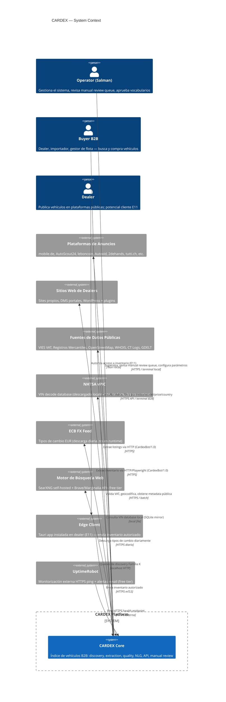

# 01 — System Context (C4 Level 1)

## Identificador
- Nivel C4: Context, Fecha: 2026-04-14, Estado: DOCUMENTADO

## Descripción general

CARDEX es un índice B2B de vehículos de ocasión pan-europeo. El sistema no almacena imágenes ni descripciones de terceros — funciona como un motor de indexación que apunta a las fuentes originales. El operador Salman supervisa el sistema; los compradores B2B (dealers, importadores, gestores de flotas) consultan el índice; los dealers son tanto fuentes de datos como potenciales clientes.

## Diagrama C4 — Context

## Actores externos

### Operator (Salman)
- **Rol:** administrador único del sistema en fase inicial
- **Acceso:** terminal local, SSH al VPS, manual review UI (React SPA localhost con tunel SSH)
- **Responsabilidades:** revisar manual review queue (<24h SLA), aprobar vocabularios V18, gestionar DLQ, monitorizar dashboards Grafana, responder a alertas de observabilidad
- **Frecuencia:** acceso diario (~1-2h/día en fase growth, <30min/día en steady state)

### Buyers B2B
- **Rol:** clientes principales — dealers comprando stock para sus lotes, importadores buscando arbitraje entre mercados, gestores de flotas corporativas
- **Acceso:** API terminal B2B (HTTPS), en iteración futura UI web
- **Necesidad:** buscar vehículos por make/model/year/km/price/country, ver datos neutrales, acceder al dealer directamente
- **Interacción con CARDEX:** CARDEX es un índice — el comprador ve los datos, pero el contacto y la transacción ocurren directamente con el dealer (CARDEX no intermedia la transacción)

### Dealers (fuente de datos)
- **Rol dual:** fuente de datos públicos (sus listings en plataformas) y potenciales suscriptores B2B
- **Tipo A (pasivo):** dealer con listings en mobile.de/AutoScout24 — indexado sin intervención del dealer
- **Tipo B (activo E11):** dealer que instala el Edge Client Tauri y autoriza acceso directo a su inventario DMS — mayor fidelidad de datos, menor latencia
- **Base legal para indexación:** robots.txt compliance, EU Data Act / DSA para datos de acceso público

### Plataformas de anuncios (fuente E01-E07)
- mobile.de, AutoScout24, leboncoin, Autovid, 2dehands, tutti.ch, Marktplaats, etc.
- CARDEX extrae con CardexBot/1.0 UA identificable, respeta robots.txt y rate limits declarados

### Sitios web de dealers (fuente E01-E12)
- 6.000-50.000 dominios según fase de growth
- Tipos: WordPress+plugin, DMS portal, sitio custom, solo redes sociales
- Extracción mediante cascada E01-E12

### Fuentes de datos públicas (Discovery familias A-O)
- VIES (validación VAT batch, gratuito)
- Registros mercantiles DE/FR/ES/BE/NL (HANDELSREGISTER, INFOGREFFE, BORME, etc.)
- OpenStreetMap Nominatim (geocodificación, CC-BY-SA)
- WHOIS histórico, CT Logs (crt.sh), BGP/ASN (bgp.he.net)
- GDELT (noticias, CC0)

## Boundaries del sistema

### Dentro de CARDEX
- Pipeline de discovery (familias A-O)
- Pipeline de extracción (E01-E12)
- Pipeline de calidad (V01-V20)
- Knowledge graph (SQLite)
- Índice OLAP (DuckDB + parquet)
- NLG service (Llama 3 8B)
- API service
- Manual review UI
- Observabilidad (Prometheus + Grafana)
- CI/CD (Forgejo)

### Fuera de CARDEX (no almacenado)
- Imágenes originales de vehículos (solo punteros URL + SHA256)
- Descripciones de dealers (sustituidas por descripciones NLG CARDEX)
- Datos personales de compradores individuales (CARDEX es B2B — interacción entre empresas)
- Transacciones (CARDEX no intermedia compra/venta)

## Restricciones de boundary legal

1. **Derecho sui generis de bases de datos (Directiva 96/9/CE):** CARDEX no extrae una parte sustancial de ninguna base de datos de plataformas. Indexa metadatos estructurados, no el contenido protegido.
2. **robots.txt compliance:** el crawler respeta `Disallow` y `Crawl-delay` de todos los targets.
3. **No territorio CH para E11:** el EU Data Act (E11) no aplica en Suiza. Dealers CH solo se indexan vía E01-E10 o E12.
4. **CardexBot/1.0 UA en todas las peticiones:** identificación obligatoria, sin evasión.
