# 02 — Container Architecture (C4 Level 2)

## Identificador
- Nivel C4: Container, Fecha: 2026-04-14, Estado: DOCUMENTADO

## Descripción

Todo el stack corre en un único VPS Hetzner CX41. Los servicios Go son procesos systemd nativos (sin Docker, para maximizar rendimiento con RAM limitada). Los servicios auxiliares (SearXNG, Prometheus, Grafana, Forgejo) corren en Docker Compose por aislamiento y portabilidad de configuración.

## Diagrama C4 — Container

```mermaid
C4Container
    title CARDEX — Container Architecture (Single VPS)

    Person(operator, "Operator", "SSH + manual review UI")
    Person(buyer, "Buyer B2B", "API terminal")

    System_Boundary(vps, "Hetzner CX41 VPS — Debian 12 (4 vCPU, 16GB RAM, 240GB NVMe)") {

        Container(discovery_svc, "Discovery Service", "Go binary / systemd", "Ejecuta familias A-O, construye knowledge graph de dealers, dedup via normalized_name+VAT+geo")
        Container(extraction_svc, "Extraction Service", "Go binary / systemd + Playwright", "Orquesta E01-E12, ejecuta estrategias de extracción, alimenta quality pipeline")
        Container(quality_svc, "Quality Service", "Go binary + Python bridge / systemd", "Ejecuta V01-V20, enruta a DLQ/review/index, acumula confidence score")
        Container(nlg_svc, "NLG Service", "Python + llama.cpp CGO / systemd timer", "Batch nocturno: genera descripciones Llama 3 8B Q4_K_M, 6 idiomas, template fallback")
        Container(index_svc, "Index Writer Service", "Go binary / systemd", "Persiste registros PASS en SQLite OLTP + DuckDB OLAP, gestiona TTL y expiración")
        Container(api_svc, "API Service", "Go binary / systemd", "REST + SSE: sirve queries B2B, fan-out de invalidaciones (SOLD/WITHDRAWN)")
        Container(sse_gw, "SSE Gateway", "Go binary / systemd", "Server-Sent Events para invalidaciones en tiempo real a buyers conectados")
        Container(review_ui, "Manual Review UI", "React SPA / nginx local", "UI de revisión manual para operator, acceso solo via SSH tunnel")

        Container(nats, "NATS Embedded", "Go library (natsd embedded)", "Message broker: queues discovery→extraction, extraction→quality, quality→nlg, invalidation fan-out")

        Container(searxng, "SearXNG", "Docker container", "Motor de búsqueda alternativo self-hosted, Familia K")
        Container(prometheus, "Prometheus", "Docker container", "Scrape de métricas de todos los servicios Go + node_exporter")
        Container(grafana, "Grafana", "Docker container", "Dashboards: Coverage, Discovery, Quality, NLG, VPS Resources, Legal Compliance")
        Container(forgejo, "Forgejo", "Docker container", "CI/CD self-hosted, webhooks on push, illegal-pattern linter blocker")

        ContainerDb(sqlite_oltp, "SQLite OLTP", "SQLite 3 WAL mode", "Knowledge graph dealers, vehicle records, pipeline results, manual review queue")
        ContainerDb(duckdb_olap, "DuckDB OLAP", "DuckDB + parquet files", "Índice analítico: queries B2B de alta complejidad, agregaciones por country/make/model")
        ContainerDb(sqlite_fx, "FX Rates Cache", "SQLite", "Tipos de cambio ECB, actualización diaria")
        ContainerDb(sqlite_nhtsa, "NHTSA vPIC Mirror", "SQLite", "VIN decode local, sin llamadas en runtime")

        Container(caddy, "Caddy", "caddy binary / systemd", "Reverse proxy TLS, Let's Encrypt automático, expone solo puerto 443 al exterior")
    }

    System_Ext(edge_client, "Edge Client (Tauri/Rust)", "Deployado en dealer E11")
    System_Ext(dealers_platforms, "Dealers + Plataformas", "Fuentes de datos")
    System_Ext(public_sources, "Fuentes Públicas", "VIES, OSM, CT Logs, etc.")
    System_Ext(ecb_feed, "ECB FX Feed", "Descarga diaria")

    Rel(operator, review_ui, "Revisa queue, aprueba/rechaza", "SSH tunnel → localhost:3000")
    Rel(operator, grafana, "Monitoriza dashboards", "SSH tunnel → localhost:3001")
    Rel(operator, forgejo, "Gestiona CI/CD", "SSH tunnel → localhost:3002")
    Rel(buyer, api_svc, "Queries B2B + SSE stream", "HTTPS via Caddy :443")

    Rel(caddy, api_svc, "Reverse proxy", "Unix socket / loopback:8080")
    Rel(api_svc, duckdb_olap, "Queries analíticas", "DuckDB Go driver")
    Rel(api_svc, sqlite_oltp, "Queries de detail", "SQLite Go driver")
    Rel(api_svc, sse_gw, "Fan-out invalidaciones", "NATS subscription")

    Rel(discovery_svc, nats, "Publica dealer_discovered events", "NATS publish")
    Rel(discovery_svc, sqlite_oltp, "Lee/escribe knowledge graph", "SQLite WAL")
    Rel(discovery_svc, searxng, "Queries Familia K", "HTTP localhost:8888")
    Rel(discovery_svc, public_sources, "Valida VAT, geocodifica", "HTTPS")

    Rel(nats, extraction_svc, "dealer_ready → extraction queue", "NATS subscribe")
    Rel(extraction_svc, dealers_platforms, "Extrae listings (CardexBot/1.0)", "HTTPS")
    Rel(extraction_svc, sqlite_oltp, "Guarda vehicle_raw records", "SQLite WAL")
    Rel(extraction_svc, nats, "Publica vehicle_raw_ready events", "NATS publish")

    Rel(nats, quality_svc, "vehicle_raw_ready → quality queue", "NATS subscribe")
    Rel(quality_svc, sqlite_oltp, "Lee/escribe pipeline_results", "SQLite WAL")
    Rel(quality_svc, sqlite_nhtsa, "VIN decode V02", "SQLite read-only")
    Rel(quality_svc, sqlite_fx, "FX rates V15", "SQLite read-only")
    Rel(quality_svc, nats, "Publica vehicle_validated / nlg_pending events", "NATS publish")

    Rel(nats, nlg_svc, "nlg_pending → nlg queue", "NATS subscribe")
    Rel(nlg_svc, sqlite_oltp, "Escribe description_generated_ml", "SQLite WAL")
    Rel(nlg_svc, nats, "Publica nlg_complete events", "NATS publish")

    Rel(nats, index_svc, "nlg_complete → index queue", "NATS subscribe")
    Rel(index_svc, sqlite_oltp, "Actualiza status ACTIVE", "SQLite WAL")
    Rel(index_svc, duckdb_olap, "Upsert en parquet index", "DuckDB Go driver")

    Rel(index_svc, nats, "Publica vehicle_live events (fan-out)", "NATS publish")
    Rel(nats, sse_gw, "vehicle_live → SSE stream a buyers", "NATS subscribe")

    Rel(edge_client, api_svc, "POST /edge/inventory (mTLS)", "HTTPS")

    Rel(prometheus, discovery_svc, "Scrape /metrics", "HTTP loopback:9101")
    Rel(prometheus, extraction_svc, "Scrape /metrics", "HTTP loopback:9102")
    Rel(prometheus, quality_svc, "Scrape /metrics", "HTTP loopback:9103")
    Rel(prometheus, nlg_svc, "Scrape /metrics", "HTTP loopback:9104")
    Rel(prometheus, api_svc, "Scrape /metrics", "HTTP loopback:9105")
    Rel(prometheus, index_svc, "Scrape /metrics", "HTTP loopback:9106")

    Rel(grafana, prometheus, "Query métricas", "HTTP loopback:9090")

    Rel(forgejo, api_svc, "Webhook on push → CI pipeline", "HTTP loopback:3002")

    Rel(sqlite_fx, ecb_feed, "Descarga diaria (systemd timer)", "HTTPS diario")
```



## Inventario de containers

### Servicios Go (procesos systemd nativos)

| Servicio | Binario | Puerto interno | RAM esperada | CPU esperada |
|---|---|---|---|---|
| discovery.service | `cardex-discovery` | :9101 (metrics) | ~200 MB | 0.2-0.8 vCPU (bursts) |
| extraction.service | `cardex-extraction` | :9102 (metrics) | ~300 MB + Playwright | 0.5-1.5 vCPU |
| quality.service | `cardex-quality` | :9103 (metrics) | ~400 MB (ONNX models) | 0.5-2.0 vCPU |
| nlg-batch.timer | `cardex-nlg` | :9104 (metrics) | ~4.5 GB (Llama 3 8B Q4) | 3.5-4 vCPU (ventana nocturna) |
| index-writer.service | `cardex-index` | :9106 (metrics) | ~100 MB | 0.1-0.3 vCPU |
| api.service | `cardex-api` | :8080 (HTTP), :9105 (metrics) | ~150 MB | 0.1-0.5 vCPU |
| sse-gateway.service | `cardex-sse` | :8081 | ~80 MB | 0.05-0.2 vCPU |
| caddy.service | `caddy` | :443 (ext), :80 (redirect) | ~50 MB | minimal |

**Total Go processes en steady state (sin NLG):** ~1.3 GB RAM
**Durante ventana NLG nocturna:** ~5.8 GB RAM (Llama 3 8B domina)
**VPS RAM disponible:** 16 GB → headroom suficiente

### Servicios Docker Compose

| Container | Imagen | Puerto local | RAM límite |
|---|---|---|---|
| searxng | `searxng/searxng:latest` | :8888 | 512 MB |
| prometheus | `prom/prometheus:latest` | :9090 | 512 MB |
| grafana | `grafana/grafana:latest` | :3001 | 256 MB |
| forgejo | `codeberg.org/forgejo/forgejo:latest` | :3002, :2222 (SSH) | 512 MB |

**Total Docker overhead:** ~2 GB RAM incluyendo Docker daemon

### Data stores

| Store | Tipo | Ubicación | Tamaño estimado S0 |
|---|---|---|---|
| SQLite OLTP | SQLite 3 WAL | `/srv/cardex/db/main.db` | 5-20 GB |
| DuckDB OLAP | DuckDB + parquet | `/srv/cardex/olap/` | 10-50 GB parquet |
| FX Rates | SQLite | `/srv/cardex/db/fx.db` | <10 MB |
| NHTSA vPIC | SQLite | `/srv/cardex/db/nhtsa.db` | ~3.5 GB (mirror completo) |
| MaxMind GeoLite2 | binary | `/srv/cardex/data/geo/` | ~100 MB |
| ONNX models | binary | `/srv/cardex/models/` | ~500 MB (YOLOv8n, MobileNetV3, spaCy) |
| Llama 3 8B Q4_K_M | GGUF | `/srv/cardex/models/llm/` | ~4.5 GB |
| LanguageTool | JAR | `/srv/cardex/lt/` | ~200 MB |

**Total almacenamiento estimado S0:** ~60-80 GB de 240 GB disponibles

## Flujo de memoria RAM por horario

```
00:00-06:00 (ventana NLG)
  Go services:    ~1.3 GB
  NLG batch:      ~4.5 GB
  Docker:         ~2.0 GB
  OS + overhead:  ~1.0 GB
  TOTAL:          ~8.8 GB / 16 GB ✓

06:00-23:59 (steady state)
  Go services:    ~1.3 GB
  Docker:         ~2.0 GB
  OS + overhead:  ~1.0 GB
  TOTAL:          ~4.3 GB / 16 GB ✓ (headroom 11.7 GB para spikes)
```
