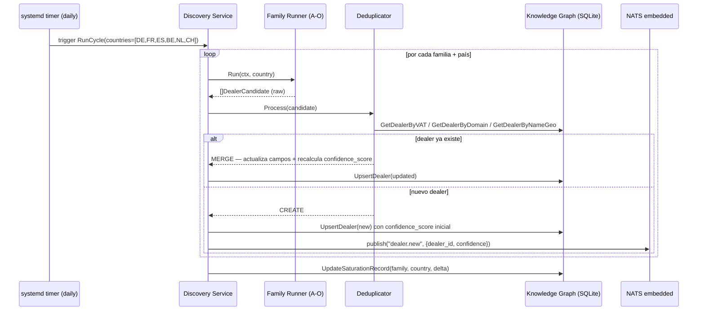
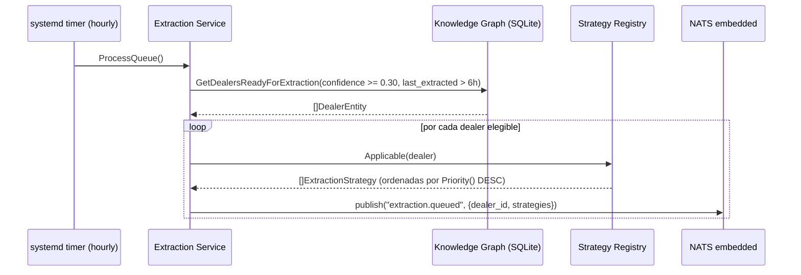
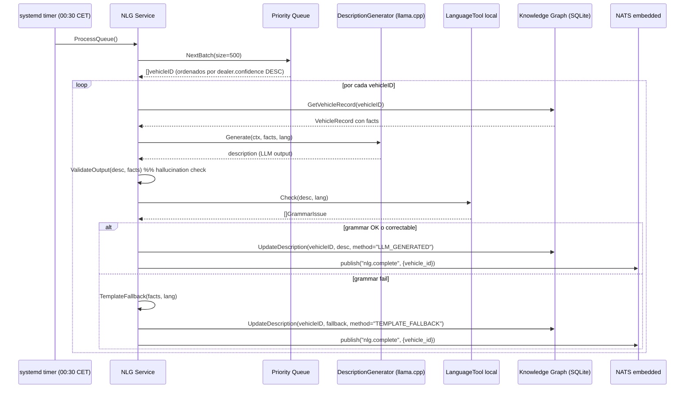
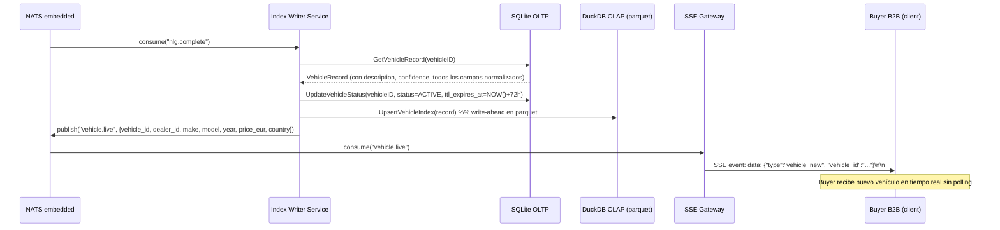
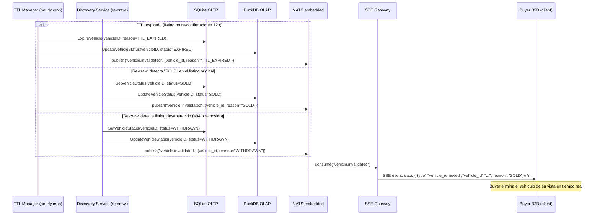

# 04 — Data Flow (End-to-End)

## Identificador
- Fecha: 2026-04-14, Estado: DOCUMENTADO

## Descripción

El flujo completo desde la ejecución de una familia de discovery hasta que un vehículo aparece en el índice accesible a compradores B2B. Los siete flujos principales son secuenciales pero asincrónicos — cada etapa consume una cola NATS y produce la siguiente.

## Flujo 1: Discovery → Knowledge Graph



## Flujo 2: Knowledge Graph → Extraction Assignment



## Flujo 3: Extraction → Vehicle Raw

```mermaid
sequenceDiagram
    participant NATS as NATS embedded
    participant ES as Extraction Service
    participant E as Strategy (E01-E12)
    participant Playwright as Playwright Runner
    participant Dealer as Dealer Site / Platform
    participant KG as Knowledge Graph (SQLite)

    NATS->>ES: consume("extraction.queued")
    loop strategies en orden Priority() DESC
        ES->>E: Applicable(dealer)?
        alt applicable
            ES->>E: Extract(ctx, dealer)
            alt E01-E06 o E08-E10 (HTTP directo)
                E->>Dealer: GET listing URLs (CardexBot/1.0)
                Dealer-->>E: HTML / JSON / XML / PDF / CSV
            else E07 (Playwright)
                E->>Playwright: FetchPage(url) / InterceptXHR(url, patterns)
                Playwright->>Dealer: navegación headless (CardexBot/1.0, cero evasión)
                Dealer-->>Playwright: content + XHR responses
                Playwright-->>E: PageContent + []XHRCapture
            end
            E-->>ES: ExtractionResult{vehicles, partialSuccess}
            alt success (full o partial)
                ES->>KG: UpsertVehicleRaw(result.vehicles)
                ES->>NATS: publish("vehicle.raw.ready", {vehicle_ids})
                break  %% primera estrategia exitosa termina la cascada
            else fail
                note over ES: continuar con siguiente estrategia
            end
        end
    end
    alt todas las estrategias fallaron
        ES->>NATS: publish("extraction.failed", {dealer_id})
        note over ES: dealer encolado para E11 (si EU) o E12 (manual)
    end
```

## Flujo 4: Quality Pipeline V01-V20

```mermaid
sequenceDiagram
    participant NATS as NATS embedded
    participant QS as Quality Service
    participant V as Validators V01-V20
    participant KG as Knowledge Graph (SQLite)
    participant MRQ as Manual Review Queue
    participant DLQ as Dead Letter Queue

    NATS->>QS: consume("vehicle.raw.ready")

    loop V01 → V20 en orden de fase
        QS->>V: Validate(ctx, record, graph)
        V-->>QS: ValidationResult{status, severity, delta, nextAction}

        alt status=PASS
            QS->>KG: SavePipelineResult(vehicleID, result)
            note over QS: confidence_score += delta, continuar
        else status=FAIL && severity=BLOCKING
            QS->>DLQ: Enqueue(record, outcome)
            QS->>NATS: publish("vehicle.dlq", {vehicle_id, reason})
            break  %% pipeline detiene para este record
        else status=FAIL && severity=WARNING
            QS->>MRQ: Enqueue(record, reason)
            note over QS: flag añadido, pipeline continúa
        else status=FAIL && severity=INFO
            note over QS: log + continúa (confidence_score += delta negativo)
        else status=SKIP
            note over QS: validator no aplicable, continúa sin delta
        end
    end

    alt todos los validators pasados (V20 PASS)
        QS->>NATS: publish("vehicle.validated", {vehicle_id, final_confidence})
        note over QS: si NLG pendiente → publish("nlg.pending", {vehicle_id, priority})
    end
```

## Flujo 5: NLG Batch Nocturno



## Flujo 6: Index → Publicación Live



## Flujo 7: Invalidación (SOLD / WITHDRAWN / TTL Expired)



## Diagrama de estados de un VehicleRecord

```
                              [PENDING_EXTRACTION]
                                      |
                              Extraction OK (E01-E12)
                                      |
                              [PENDING_QUALITY]
                                      |
                        ┌─────────────┴──────────────┐
                    V01-V20                        V_BLOCKING
                    all PASS                        FAIL
                        |                              |
              [PENDING_NLG]                         [DLQ]
                        |                              |
               NLG generated                      retry / purge
                        |
                     [ACTIVE]  ←──── SSE fan-out a buyers
                        |
             ┌──────────┼──────────┐
           SOLD     WITHDRAWN   TTL_EXPIRED
             |          |           |
         [SOLD]   [WITHDRAWN]   [EXPIRED]
                                      ↓
                              SSE invalidation event
```

## Latencias esperadas end-to-end

| Etapa | Latencia típica | Notas |
|---|---|---|
| Discovery → knowledge graph | 2-8h por ciclo completo | 15 familias × 6 países en paralelo parcial |
| Knowledge graph → extraction queue | <5 min (hourly cron) | Para dealers con confidence ≥0.30 |
| Extraction (E01-E06) | 2-30 segundos | HTTP directo, depende del sitio |
| Extraction (E07, Playwright) | 10-120 segundos | Renderizado completo + XHR |
| Quality V01-V20 | 500ms-5s | Sin LLM en V20 si confidence ≥0.55 |
| NLG batch | ventana nocturna 00:30-06:00 | ~2-8s por registro |
| Index write → ACTIVE | <1 segundo | SQLite WAL + DuckDB append |
| SSE fan-out | <100ms | NATS pub-sub latencia negligible |
| **Total (sin NLG)** | **~1-8 horas** | Desde dealer descubierto hasta ACTIVE sin descripción |
| **Total (con NLG)** | **Siguiente noche** | Descripción generada en la próxima ventana nocturna |
