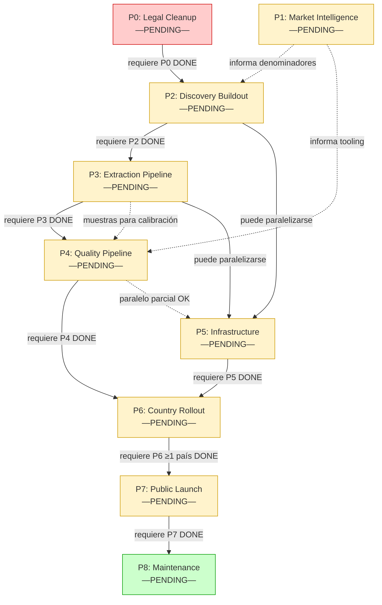

# Dependencies Graph

## Identificador
- Fecha: 2026-04-14, Estado: DOCUMENTADO

## Grafo de dependencias entre fases



**Leyenda de aristas:**
- `──►` línea sólida: dependencia **hard** (fase anterior debe estar DONE)
- `-.->` línea punteada: dependencia **soft** (informa la fase posterior pero no bloquea su inicio)

## Tabla de paralelización

| Fase | Puede correr en paralelo con | Restricción |
|---|---|---|
| P0 | P1 | P0 y P1 son independientes; P1 es solo research |
| P1 | P0 | Ídem |
| P2 | — | Requiere P0 DONE; no puede paralelizarse con P3 |
| P3 | P5 (parcial) | P5 puede empezar preparación de VPS mientras P3 está en curso |
| P4 | P5 (parcial) | P5 puede avanzar; deploy de producción espera P4 DONE |
| P5 | P3, P4 (preparación) | Preparación VPS en paralelo; deploy final espera P4 DONE |
| P6 | — | Requiere P2+P3+P4+P5 todos DONE |
| P7 | — | Requiere P6 ≥1 país DONE |
| P8 | — | Requiere P7 DONE |

## Camino crítico

El camino crítico (secuencia de fases que determina la duración mínima del proyecto) es:

```
P0 → P2 → P3 → P4 → P5 (final) → P6 → P7 → P8
```

P1 está fuera del camino crítico porque es paralelo a P0 y no bloquea a P2 directamente (P2 puede iniciar con denominadores preliminares y refinar en P6).

P5 está parcialmente fuera del camino crítico: la preparación de infraestructura puede hacerse mientras P3 y P4 están en curso; solo el deploy final de binarios de producción requiere P4 DONE.

## Diagrama de flujo de fases activas por período

```
Período 1: P0 + P1 (paralelo)
Período 2: P2 (requiere P0 DONE)
Período 3: P3 + P5_prep (P5 preparación de VPS mientras P3 avanza)
Período 4: P4 + P5_prep (continúa)
Período 5: P5_deploy (deploy final con binarios de P4)
Período 6: P6 (NL primero)
Período 7: P6 (DE, luego FR, ES, BE, CH — secuencial con 30d gate cada uno)
Período 8: P7 (soft launch piloto)
Período 9: P7 (60d métricas estables + apertura pública)
Período 10+: P8 (indefinido)
```

## Dependencias de datos entre fases

| Datos producidos | Fase productora | Fases consumidoras |
|---|---|---|
| Lista de dealers por país (knowledge graph) | P2 | P3, P6 |
| vehicle_raw records | P3 | P4 |
| Dataset etiquetado para calibración validators | P3 (muestra) | P4 |
| Denominadores oficiales por país | P1 | P2 (CS-2-4), P6 (CS-6-A thresholds) |
| Confidence thresholds calibrados | P4 | P6, P7 |
| T_BLEU calibrado | P4 | P6, P8 |
| Binarios Go de producción | P4 | P5 deploy |
| VPS productivo con observabilidad | P5 | P6, P7, P8 |
| Índice público de vehículos ≥1 país | P6 | P7 |
| Buyers piloto con NPS | P7 | P8 (calibración de SLA) |

## Restricciones de orden inviolables

Estas restricciones son absolutas y no admiten excepciones:

1. **P2 no puede arrancar con código que contenga técnicas de evasión** — P0 debe estar DONE
2. **P3 no puede producir datos de calidad sin un knowledge graph poblado** — P2 debe estar DONE
3. **P4 no puede calibrarse sin muestras reales de vehicle_raw** — P3 debe estar al menos al 50%
4. **P6 no puede activar ningún país sin pipeline completo y validado** — P3+P4 DONE
5. **P6 no puede activar ningún país en VPS de staging** — P5 DONE
6. **P7 no puede hacer soft launch sin al menos 1 país activo** — P6 ≥1 país DONE
7. **P8 no es un estado al que se "llegue"** — P8 comienza automáticamente cuando P7 está DONE
